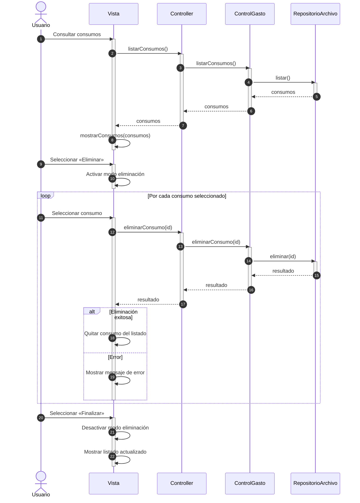

```mermaid
sequenceDiagram
    autonumber
    actor U as Usuario
    participant V as Vista
    participant C as Controller
    participant G as ControlGasto
    participant R as RepositorioArchivo

    U->>V: Consultar consumos
    activate V
    V->>C: listarConsumos()
    activate C
    C->>G: listarConsumos()
    activate G
    G->>R: listar()
    activate R
    R-->>G: consumos
    deactivate R
    G-->>C: consumos
    deactivate G
    C-->>V: consumos
    deactivate C
    V->>V: mostrarConsumos(consumos)
    deactivate V

    U->>V: Seleccionar «Eliminar»
    activate V
    V->>V: Activar modo eliminación
    deactivate V

    loop Por cada consumo seleccionado
        U->>V: Seleccionar consumo
        activate V
        V->>C: eliminarConsumo(id)
        activate C
        C->>G: eliminarConsumo(id)
        activate G
        G->>R: eliminar(id)
        activate R
        R-->>G: resultado
        deactivate R
        G-->>C: resultado
        deactivate G
        C-->>V: resultado
        deactivate C

        alt Eliminación exitosa
            V->>V: Quitar consumo del listado
        else Error
            V->>V: Mostrar mensaje de error
        end
        deactivate V
    end

    U->>V: Seleccionar «Finalizar»
    activate V
    V->>V: Desactivar modo eliminación
    V->>V: Mostrar listado actualizado
    deactivate V
```
