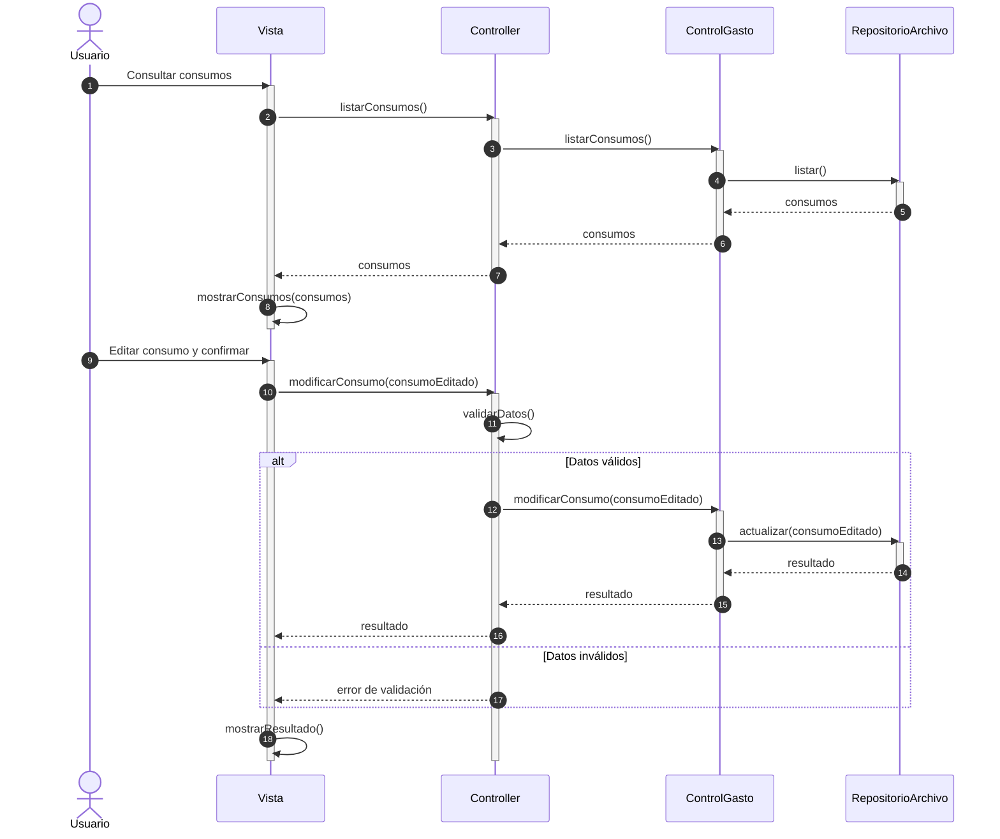

```mermaid
sequenceDiagram
    autonumber
    actor U as Usuario
    participant V as Vista
    participant C as Controller
    participant G as ControlGasto
    participant R as RepositorioArchivo

    U->>V: Consultar consumos
    activate V
    V->>C: listarConsumos()
    activate C
    C->>G: listarConsumos()
    activate G
    G->>R: listar()
    activate R
    R-->>G: consumos
    deactivate R
    G-->>C: consumos
    deactivate G
    C-->>V: consumos
    deactivate C
    V->>V: mostrarConsumos(consumos)
    deactivate V

    U->>V: Editar consumo y confirmar
    activate V
    V->>C: modificarConsumo(consumoEditado)
    activate C
    C->>C: validarDatos()

    alt Datos válidos
        C->>G: modificarConsumo(consumoEditado)
        activate G
        G->>R: actualizar(consumoEditado)
        activate R
        R-->>G: resultado
        deactivate R
        G-->>C: resultado
        deactivate G
        C-->>V: resultado
    else Datos inválidos
        C-->>V: error de validación
    end

    V->>V: mostrarResultado()
    deactivate C
    deactivate V
```
