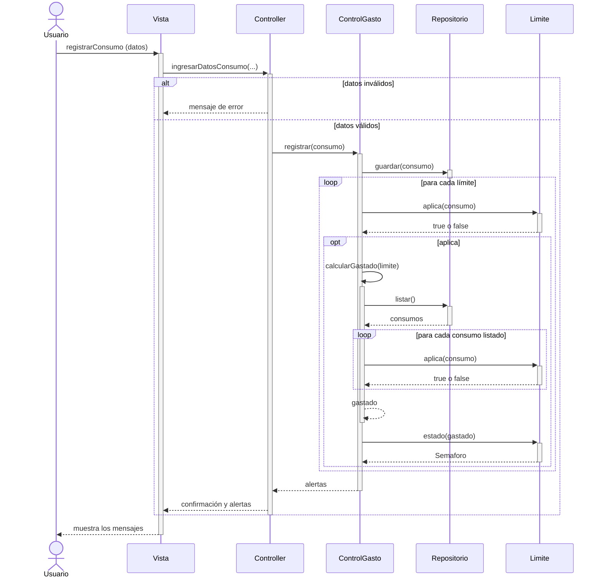

```mermaid
sequenceDiagram
    actor Usuario
    participant Vista
    participant Controller
    participant ControlGasto
    participant Repositorio
    participant Limite

    Usuario->>+Vista: registrarConsumo (datos)
    Vista->>+Controller: ingresarDatosConsumo(...)

    alt datos inválidos
        Controller-->>Vista: mensaje de error
    else datos válidos
        Controller->>+ControlGasto: registrar(consumo)
        ControlGasto->>+Repositorio: guardar(consumo)
        deactivate Repositorio

        loop para cada límite
            ControlGasto->>+Limite: aplica(consumo)
            Limite-->>-ControlGasto: true o false
            opt aplica
                ControlGasto->>+ControlGasto: calcularGastado(limite)
                ControlGasto->>+Repositorio: listar()
                Repositorio-->>-ControlGasto: consumos
                loop para cada consumo listado
                    ControlGasto->>+Limite: aplica(consumo)
                    Limite-->>-ControlGasto: true o false
                end
                ControlGasto-->>-ControlGasto: gastado
                ControlGasto->>+Limite: estado(gastado)
                Limite-->>-ControlGasto: Semaforo
            end
        end

        ControlGasto-->>Controller: alertas
        deactivate ControlGasto
        Controller-->>Vista: confirmación y alertas
    end
    deactivate Controller
    Vista-->>-Usuario: muestra los mensajes
```
