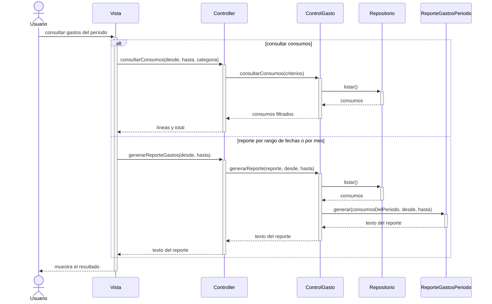

```mermaid
sequenceDiagram
    actor Usuario
    participant Vista
    participant Controller
    participant ControlGasto
    participant Repositorio
    participant ReporteGastosPeriodo

    Usuario->>+Vista: consultar gastos del período

    alt consultar consumos
        Vista->>+Controller: consultarConsumos(desde, hasta, categoria)
        Controller->>+ControlGasto: consultarConsumos(criterios)
        ControlGasto->>+Repositorio: listar()
        Repositorio-->>-ControlGasto: consumos
        ControlGasto-->>-Controller: consumos filtrados
        Controller-->>-Vista: líneas y total
    else reporte por rango de fechas o por mes
        Vista->>+Controller: generarReporteGastos(desde, hasta)
        Controller->>+ControlGasto: generarReporte(reporte, desde, hasta)
        ControlGasto->>+Repositorio: listar()
        Repositorio-->>-ControlGasto: consumos
        ControlGasto->>+ReporteGastosPeriodo: generar(consumosDelPeriodo, desde, hasta)
        ReporteGastosPeriodo-->>-ControlGasto: texto del reporte
        ControlGasto-->>-Controller: texto del reporte
        Controller-->>-Vista: texto del reporte
    end

    Vista-->>-Usuario: muestra el resultado
```
