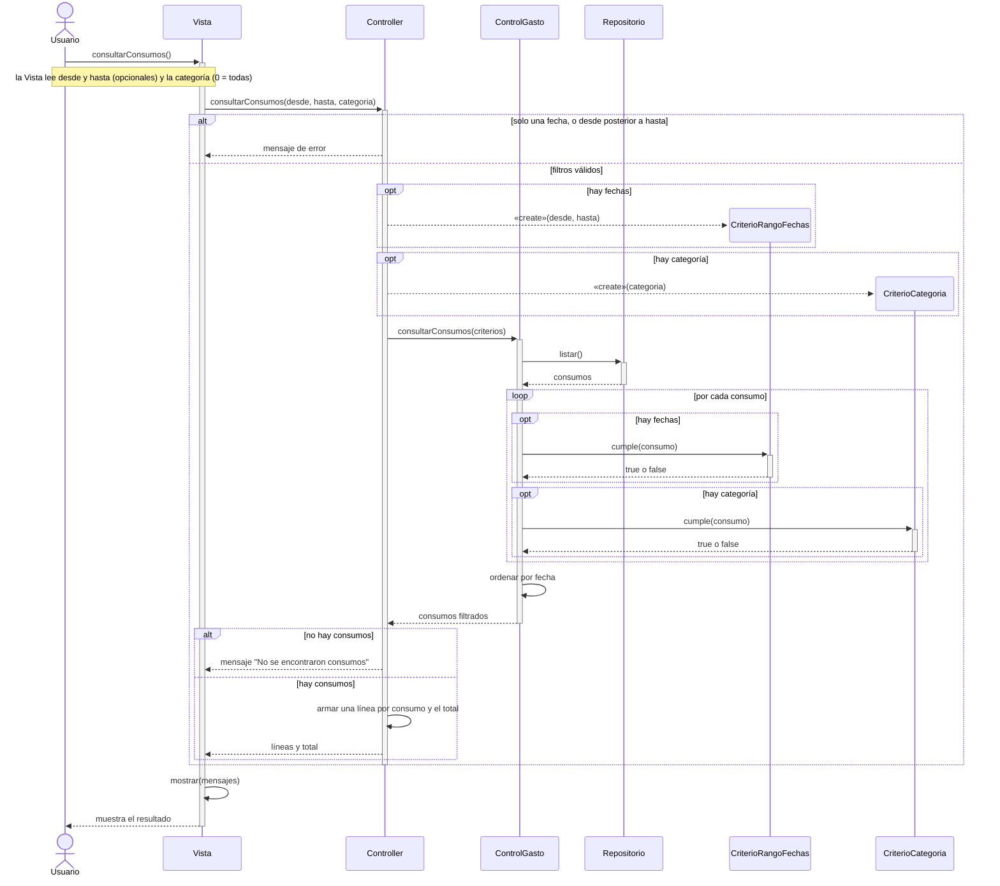
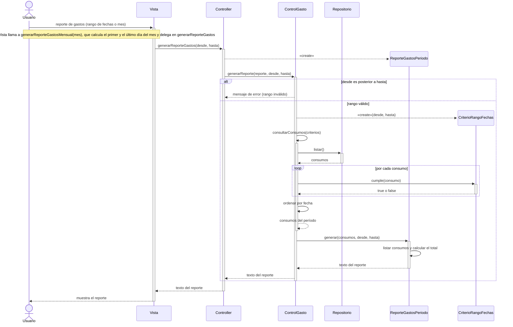

# CU10 – Consultar gastos del período

## Parte 1 – Consultar consumos (con filtros opcionales)

```mermaid
sequenceDiagram
    actor Usuario
    participant Vista
    participant Controller
    participant ControlGasto
    participant Repositorio

    Usuario->>+Vista: consultarConsumos()
    Note over Usuario,Vista: la Vista lee desde y hasta (opcionales) y la categoría (0 = todas)
    Vista->>+Controller: consultarConsumos(desde, hasta, categoria)

    alt solo una fecha, o desde posterior a hasta
        Controller-->>Vista: mensaje de error
    else filtros válidos
        opt hay fechas
            create participant CriterioRangoFechas
            Controller-->>CriterioRangoFechas: «create»(desde, hasta)
        end
        opt hay categoría
            create participant CriterioCategoria
            Controller-->>CriterioCategoria: «create»(categoria)
        end

        Controller->>+ControlGasto: consultarConsumos(criterios)
        ControlGasto->>+Repositorio: listar()
        Repositorio-->>-ControlGasto: consumos
        loop por cada consumo
            opt hay fechas
                ControlGasto->>+CriterioRangoFechas: cumple(consumo)
                CriterioRangoFechas-->>-ControlGasto: true o false
            end
            opt hay categoría
                ControlGasto->>+CriterioCategoria: cumple(consumo)
                CriterioCategoria-->>-ControlGasto: true o false
            end
        end
        ControlGasto->>ControlGasto: ordenar por fecha
        ControlGasto-->>-Controller: consumos filtrados

        alt no hay consumos
            Controller-->>Vista: mensaje "No se encontraron consumos"
        else hay consumos
            Controller->>Controller: armar una línea por consumo y el total
            Controller-->>Vista: líneas y total
        end
    end
    deactivate Controller

    Vista->>Vista: mostrar(mensajes)
    Vista-->>-Usuario: muestra el resultado
```

## Parte 2 – Reporte de gastos (por rango de fechas o por mes)

```mermaid
sequenceDiagram
    actor Usuario
    participant Vista
    participant Controller
    participant ControlGasto
    participant Repositorio

    Usuario->>+Vista: reporte de gastos (rango de fechas o mes)
    Note over Usuario,Vista: si elige un mes, la Vista llama a generarReporteGastosMensual(mes), que calcula el primer y el último día del mes y delega en generarReporteGastos
    Vista->>+Controller: generarReporteGastos(desde, hasta)
    create participant ReporteGastosPeriodo
    Controller-->>ReporteGastosPeriodo: «create»
    Controller->>+ControlGasto: generarReporte(reporte, desde, hasta)

    alt desde es posterior a hasta
        ControlGasto-->>Controller: mensaje de error (rango inválido)
    else rango válido
        create participant CriterioRangoFechas
        ControlGasto-->>CriterioRangoFechas: «create»(desde, hasta)
        ControlGasto->>+ControlGasto: consultarConsumos(criterios)
        ControlGasto->>+Repositorio: listar()
        Repositorio-->>-ControlGasto: consumos
        loop por cada consumo
            ControlGasto->>+CriterioRangoFechas: cumple(consumo)
            CriterioRangoFechas-->>-ControlGasto: true o false
        end
        ControlGasto->>ControlGasto: ordenar por fecha
        ControlGasto-->>-ControlGasto: consumos del período
        ControlGasto->>+ReporteGastosPeriodo: generar(consumos, desde, hasta)
        ReporteGastosPeriodo->>ReporteGastosPeriodo: listar consumos y calcular el total
        ReporteGastosPeriodo-->>-ControlGasto: texto del reporte
        ControlGasto-->>Controller: texto del reporte
    end
    deactivate ControlGasto

    Controller-->>-Vista: texto del reporte
    Vista-->>-Usuario: muestra el reporte
```
