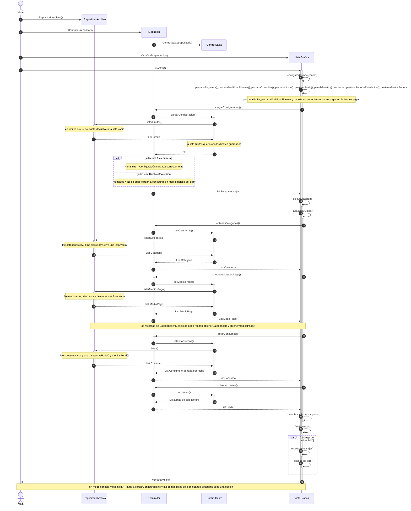

```mermaid
sequenceDiagram
    autonumber
    actor Main
    create participant R as :RepositorioArchivo
    Main->>R: RepositorioArchivo()
    create participant C as :Controller
    Main->>C: Controller(repositorio)
    create participant CG as :ControlGasto
    C->>CG: ControlGasto(repositorio)
    create participant V as :VistaGrafica
    Main->>V: VistaGrafica(controller)

    Main->>+V: mostrar()
    V->>V: configurarCombo(combo)
    V->>V: pestanaRegistrar(), pestanaModificarEliminar(), pestanaConsultar(), pestanaLimite(), pestanaSaldo(), panelMaestro() dos veces, pestanaReporteEstadistico(), pestanaGastosPeriodo()
    Note over V: pestanaLimite, pestanaModificarEliminar y panelMaestro registran sus recargas en la lista recargas

    V->>+C: cargarConfiguracion()
    C->>+CG: cargarConfiguracion()
    CG->>+R: listarLimites()
    Note over R: lee limites.csv, si no existe devuelve una lista vacía
    R-->>-CG: List Limite
    Note over CG: la lista limites queda con los límites guardados
    CG-->>-C: ok
    alt la lectura fue correcta
        Note over C: mensajes = Configuración cargada correctamente
    else hubo una RuntimeException
        Note over C: mensajes = No se pudo cargar la configuración más el detalle del error
    end
    C-->>-V: List String mensajes

    V->>+V: ejecutar(accion)
    V->>+V: actualizarListas()
    V->>+C: obtenerCategorias()
    C->>+CG: getCategorias()
    CG->>+R: listarCategorias()
    Note over R: lee categorias.csv, si no existe devuelve una lista vacía
    R-->>-CG: List Categoria
    CG-->>-C: List Categoria
    C-->>-V: List Categoria

    V->>+C: obtenerMediosPago()
    C->>+CG: getMediosPago()
    CG->>+R: listarMediosPago()
    Note over R: lee medios.csv, si no existe devuelve una lista vacía
    R-->>-CG: List MedioPago
    CG-->>-C: List MedioPago
    C-->>-V: List MedioPago

    Note over V,R: las recargas de Categorías y Medios de pago repiten obtenerCategorias() y obtenerMediosPago()
    V->>+C: listarConsumos()
    C->>+CG: listarConsumos()
    CG->>+R: listar()
    Note over R: lee consumos.csv y usa categoriasPorId() y mediosPorId()
    R-->>-CG: List Consumo
    CG-->>-C: List Consumo ordenada por fecha
    C-->>-V: List Consumo

    V->>+C: obtenerLimites()
    C->>+CG: getLimites()
    CG-->>-C: List Limite de solo lectura
    C-->>-V: List Limite
    V-->>-V: combos y listas cargados
    V-->>-V: fin de ejecutar

    alt la carga de límites falló
        V->>+V: mostrar(mensajes)
        V-->>-V: diálogo de error
    end
    V-->>-Main: ventana visible

    Note over Main,V: en modo consola Vista.iniciar() llama a cargarConfiguracion() y las demás listas se leen cuando el usuario elige una opción
```