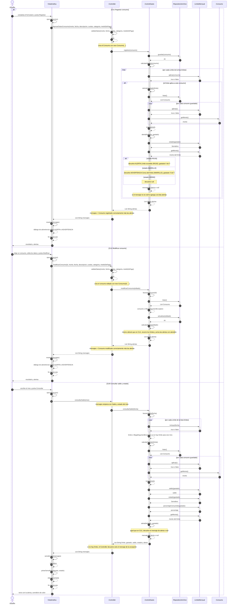

```mermaid
sequenceDiagram
    autonumber
    actor Usuario
    participant V as :VistaGrafica
    participant C as :Controller
    participant CG as :ControlGasto
    participant R as :RepositorioArchivo
    participant L as :LimiteMensual
    participant CON as :Consumo

    alt CU1 Registrar consumo
        Usuario->>+V: completa el formulario y pulsa Registrar
        V->>+V: ejecutar(accion)
        V->>+C: ingresarDatosConsumo(monto, fecha, descripcion, cuotas, categoria, medioDePago)
        C->>+C: validarDatos(monto, fecha, cuotas, categoria, medioDePago)
        C-->>-C: true
        Note over C: crea el Consumo con new Consumo(...)
        C->>+CG: registrar(consumo)
        CG->>+R: guardar(consumo)
        R-->>-CG: ok
        CG->>+CG: calcularAlertas(consumo)
        loop por cada Limite de la lista limites
            CG->>+L: aplica(consumo)
            L-->>-CG: true o false
            alt el límite aplica a este consumo
                CG->>+CG: calcularGastado(limite)
                CG->>+R: listar()
                R-->>-CG: List Consumo
                loop por cada consumo guardado
                    CG->>+L: aplica(c)
                    L-->>-CG: true o false
                    CG->>+CON: getMonto()
                    CON-->>-CG: monto
                end
                CG-->>-CG: total gastado
                CG->>+CG: alertaDe(limite, gastado)
                CG->>+L: estado(gastado)
                L-->>-CG: Semaforo
                CG->>+L: getMonto()
                L-->>-CG: monto del límite
                alt estado ROJO
                    Note over CG: devuelve ALERTA Límite excedido (ROJO), gastaste X de Y
                else estado AMARILLO
                    Note over CG: devuelve ADVERTENCIA Cerca del límite (AMARILLO), gastaste X de Y
                else estado VERDE
                    Note over CG: devuelve null
                end
                CG-->>-CG: mensaje de alerta o null
                Note over CG: si el mensaje no es null lo agrega a la lista alertas
            end
        end
        CG-->>-CG: List String alertas
        CG-->>-C: List String alertas
        Note over C: mensajes = Consumo registrado correctamente más las alertas
        C-->>-V: List String mensajes
        V->>+V: mostrar(mensajes)
        V-->>-V: diálogo de advertencia si hay ALERTA o ADVERTENCIA
        V-->>-V: fin de ejecutar
        V-->>-Usuario: resultado y alertas

    else CU2 Modificar consumo
        Usuario->>+V: elige un consumo, edita los datos y pulsa Modificar
        V->>+V: ejecutar(accion)
        V->>+C: modificarConsumo(id, monto, fecha, descripcion, cuotas, categoria, medioDePago)
        C->>+C: validarDatos(monto, fecha, cuotas, categoria, medioDePago)
        C-->>-C: true
        Note over C: crea el consumo editado con new Consumo(id, ...)
        C->>+CG: modificarConsumo(editado)
        CG->>+CG: buscarConsumo(id)
        CG->>+R: listar()
        R-->>-CG: List Consumo
        CG-->>-CG: consumo o IllegalArgumentException
        CG->>+R: actualizar(editado)
        R-->>-CG: ok
        CG->>+CG: calcularAlertas(editado)
        Note over CG: mismo cálculo que en CU1, recorre los límites y arma las alertas con alertaDe
        CG-->>-CG: List String alertas
        CG-->>-C: List String alertas
        Note over C: mensajes = Consumo modificado correctamente más las alertas
        C-->>-V: List String mensajes
        V->>+V: mostrar(mensajes)
        V-->>-V: diálogo de advertencia si hay ALERTA o ADVERTENCIA
        V-->>-V: fin de ejecutar
        V-->>-Usuario: resultado y alertas

    else CU6 Consultar saldo y estado
        Usuario->>+V: escribe el mes y pulsa Consultar
        V->>+V: ejecutar(accion)
        V->>+C: consultarSaldo(mes)
        Note over C: mensajes empieza con Saldo y estado del mes
        C->>+CG: consultarSaldo(fecha)
        CG->>+CG: buscarLimite(fecha)
        loop por cada Limite de la lista limites
            CG->>+L: incluye(fecha)
            L-->>-CG: true o false
        end
        CG-->>-CG: limite o IllegalArgumentException si no hay límite para ese mes
        CG->>+CG: calcularGastado(limite)
        CG->>+R: listar()
        R-->>-CG: List Consumo
        loop por cada consumo guardado
            CG->>+L: aplica(c)
            L-->>-CG: true o false
            CG->>+CON: getMonto()
            CON-->>-CG: monto
        end
        CG-->>-CG: total gastado
        CG->>+L: saldo(gastado)
        L-->>-CG: saldo
        CG->>+L: estado(gastado)
        L-->>-CG: Semaforo
        CG->>+L: porcentajeConsumido(gastado)
        L-->>-CG: porcentaje
        CG->>+L: getMonto()
        L-->>-CG: monto del límite
        CG->>+CG: alertaDe(limite, gastado)
        Note over CG: igual que en CU1, devuelve el mensaje de alerta o null
        CG-->>-CG: mensaje de alerta o null
        CG-->>-C: List String límite, gastado, saldo, estado y alerta
        Note over C: si no hay límite, el Controller devuelve solo el mensaje de la excepción
        C-->>-V: List String mensajes
        V->>+V: semaforoDe(mensajes)
        V-->>-V: Semaforo
        V->>+V: pintarSemaforo(etiqueta, estado)
        V-->>-V: etiqueta pintada
        V-->>-V: fin de ejecutar
        V-->>-Usuario: texto con la alerta y semáforo de color
    end
```