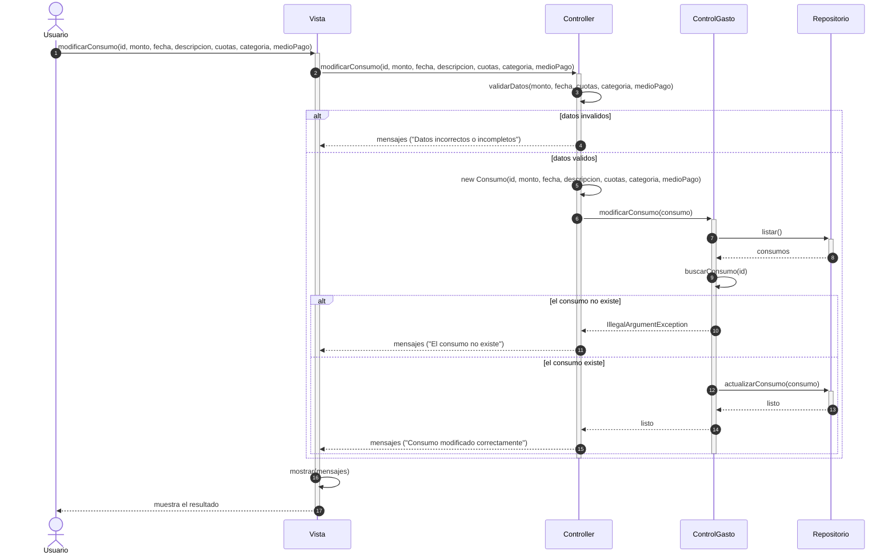

```mermaid
sequenceDiagram
    autonumber
    actor U as Usuario
    participant V as Vista
    participant C as Controller
    participant G as ControlGasto
    participant R as Repositorio

    U->>+V: modificarConsumo(id, monto, fecha, descripcion, cuotas, categoria, medioPago)
    V->>+C: modificarConsumo(id, monto, fecha, descripcion, cuotas, categoria, medioPago)

    C->>C: validarDatos(monto, fecha, cuotas, categoria, medioPago)

    alt datos invalidos
        C-->>V: mensajes ("Datos incorrectos o incompletos")
    else datos validos
        C->>C: new Consumo(id, monto, fecha, descripcion, cuotas, categoria, medioPago)
        C->>+G: modificarConsumo(consumo)
        G->>+R: listar()
        R-->>-G: consumos
        G->>G: buscarConsumo(id)

        alt el consumo no existe
            G-->>C: IllegalArgumentException
            C-->>V: mensajes ("El consumo no existe")
        else el consumo existe
            G->>+R: actualizarConsumo(consumo)
            R-->>-G: listo
            G-->>C: listo
            C-->>V: mensajes ("Consumo modificado correctamente")
        end
        deactivate G
    end

    deactivate C
    V->>V: mostrar(mensajes)
    V-->>-U: muestra el resultado
```
