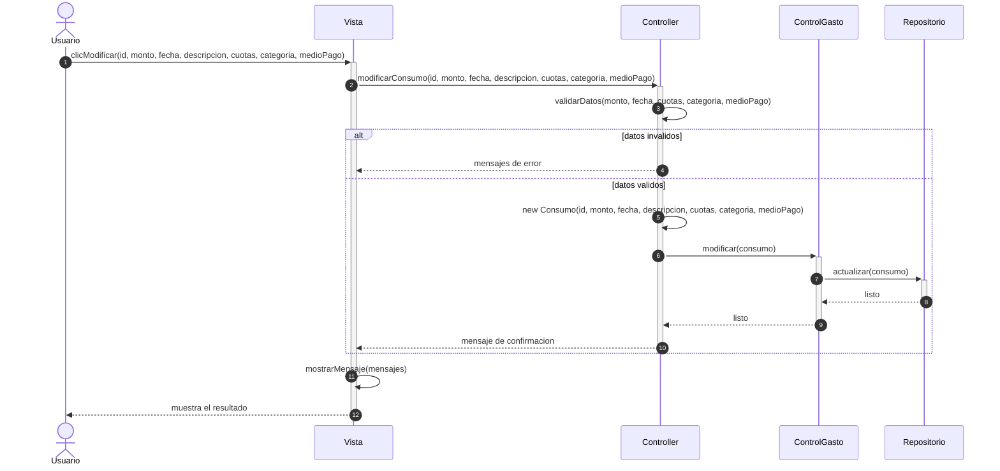

```mermaid
sequenceDiagram
    autonumber
    actor U as Usuario
    participant V as Vista
    participant C as Controller
    participant G as ControlGasto
    participant R as Repositorio

    U->>+V: clicModificar(id, monto, fecha, descripcion, cuotas, categoria, medioPago)
    V->>+C: modificarConsumo(id, monto, fecha, descripcion, cuotas, categoria, medioPago)

    C->>C: validarDatos(monto, fecha, cuotas, categoria, medioPago)

    alt datos invalidos
        C-->>V: mensajes de error
    else datos validos
        C->>C: new Consumo(id, monto, fecha, descripcion, cuotas, categoria, medioPago)
        C->>+G: modificar(consumo)
        G->>+R: actualizar(consumo)
        R-->>-G: listo
        G-->>-C: listo
        C-->>V: mensaje de confirmacion
    end

    deactivate C
    V->>V: mostrarMensaje(mensajes)
    V-->>-U: muestra el resultado
```
