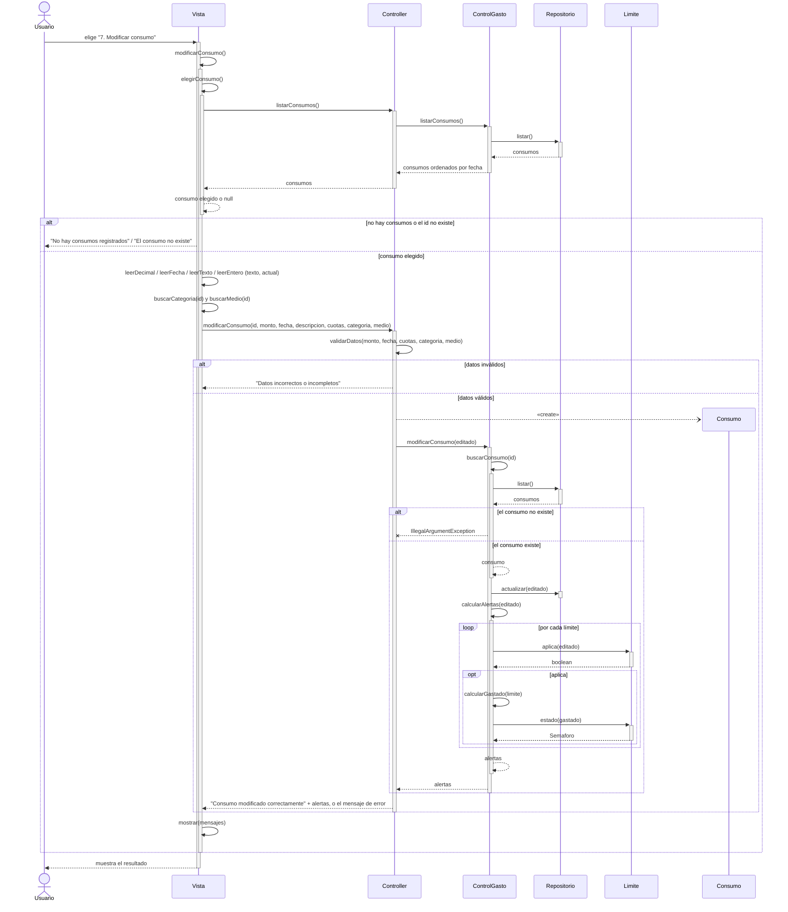

# CU2 – Modificar consumo

```mermaid
sequenceDiagram
    actor Usuario
    participant Vista
    participant Controller
    participant ControlGasto
    participant Repositorio
    participant Limite

    Usuario->>+Vista: elige "7. Modificar consumo"
    Vista->>+Vista: modificarConsumo()
    Vista->>+Vista: elegirConsumo()
    Vista->>+Controller: listarConsumos()
    Controller->>+ControlGasto: listarConsumos()
    ControlGasto->>+Repositorio: listar()
    Repositorio-->>-ControlGasto: consumos
    ControlGasto-->>-Controller: consumos ordenados por fecha
    Controller-->>-Vista: consumos
    Vista-->>-Vista: consumo elegido o null

    alt no hay consumos o el id no existe
        Vista-->>Usuario: "No hay consumos registrados" / "El consumo no existe"
    else consumo elegido
        Vista->>Vista: leerDecimal / leerFecha / leerTexto / leerEntero (texto, actual)
        Vista->>Vista: buscarCategoria(id) y buscarMedio(id)
        Vista->>+Controller: modificarConsumo(id, monto, fecha, descripcion, cuotas, categoria, medio)
        Controller->>Controller: validarDatos(monto, fecha, cuotas, categoria, medio)

        alt datos inválidos
            Controller-->>Vista: "Datos incorrectos o incompletos"
        else datos válidos
            create participant Consumo
            Controller--)Consumo: «create»
            Controller->>+ControlGasto: modificarConsumo(editado)
            ControlGasto->>+ControlGasto: buscarConsumo(id)
            ControlGasto->>+Repositorio: listar()
            Repositorio-->>-ControlGasto: consumos

            alt el consumo no existe
                ControlGasto--xController: IllegalArgumentException
            else el consumo existe
                ControlGasto-->>-ControlGasto: consumo
                ControlGasto->>+Repositorio: actualizar(editado)
                deactivate Repositorio
                ControlGasto->>+ControlGasto: calcularAlertas(editado)
                loop por cada límite
                    ControlGasto->>+Limite: aplica(editado)
                    Limite-->>-ControlGasto: boolean
                    opt aplica
                        ControlGasto->>ControlGasto: calcularGastado(limite)
                        ControlGasto->>+Limite: estado(gastado)
                        Limite-->>-ControlGasto: Semaforo
                    end
                end
                ControlGasto-->>-ControlGasto: alertas
                ControlGasto-->>Controller: alertas
            end
            deactivate ControlGasto
            Controller-->>Vista: "Consumo modificado correctamente" + alertas, o el mensaje de error
        end
        deactivate Controller
        Vista->>Vista: mostrar(mensajes)
    end
    deactivate Vista
    Vista-->>-Usuario: muestra el resultado
```
