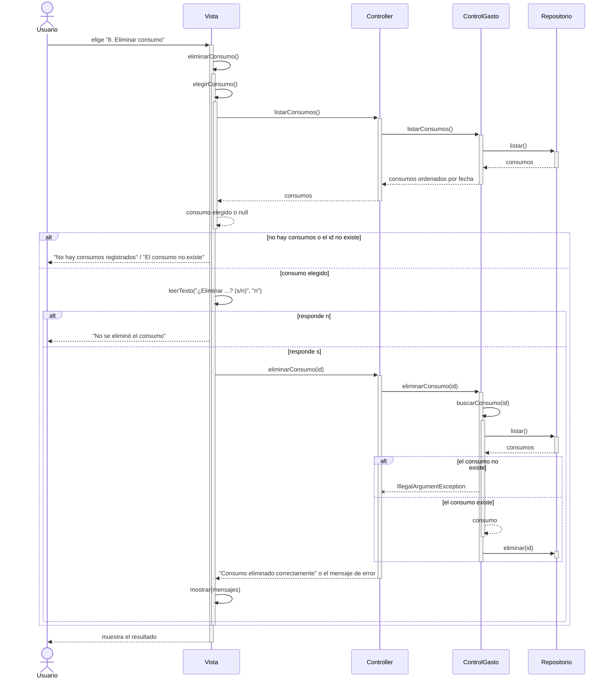

# CU3 – Eliminar consumo

```mermaid
sequenceDiagram
    actor Usuario
    participant Vista
    participant Controller
    participant ControlGasto
    participant Repositorio

    Usuario->>+Vista: elige "8. Eliminar consumo"
    Vista->>+Vista: eliminarConsumo()
    Vista->>+Vista: elegirConsumo()
    Vista->>+Controller: listarConsumos()
    Controller->>+ControlGasto: listarConsumos()
    ControlGasto->>+Repositorio: listar()
    Repositorio-->>-ControlGasto: consumos
    ControlGasto-->>-Controller: consumos ordenados por fecha
    Controller-->>-Vista: consumos
    Vista-->>-Vista: consumo elegido o null

    alt no hay consumos o el id no existe
        Vista-->>Usuario: "No hay consumos registrados" / "El consumo no existe"
    else consumo elegido
        Vista->>Vista: leerTexto("¿Eliminar ...? (s/n)", "n")
        alt responde n
            Vista-->>Usuario: "No se eliminó el consumo"
        else responde s
            Vista->>+Controller: eliminarConsumo(id)
            Controller->>+ControlGasto: eliminarConsumo(id)
            ControlGasto->>+ControlGasto: buscarConsumo(id)
            ControlGasto->>+Repositorio: listar()
            Repositorio-->>-ControlGasto: consumos

            alt el consumo no existe
                ControlGasto--xController: IllegalArgumentException
            else el consumo existe
                ControlGasto-->>-ControlGasto: consumo
                ControlGasto->>+Repositorio: eliminar(id)
                deactivate Repositorio
            end
            deactivate ControlGasto
            Controller-->>-Vista: "Consumo eliminado correctamente" o el mensaje de error
            Vista->>Vista: mostrar(mensajes)
        end
    end
    deactivate Vista
    Vista-->>-Usuario: muestra el resultado
```
