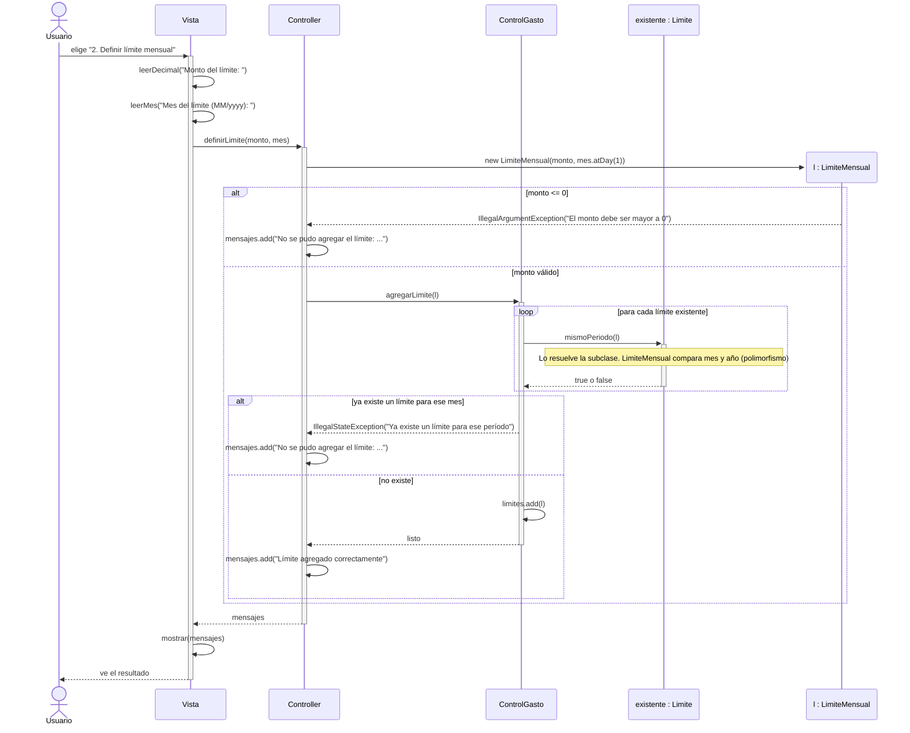

## CU5 – Definir límite

```mermaid
sequenceDiagram
    actor Usuario
    participant V as Vista
    participant C as Controller
    participant CG as ControlGasto
    participant E as existente : Limite

    Usuario->>+V: elige "2. Definir límite mensual"
    V->>V: leerDecimal("Monto del límite: ")
    V->>V: leerMes("Mes del límite (MM/yyyy): ")
    V->>+C: definirLimite(monto, mes)

    create participant L as l : LimiteMensual
    C->>L: new LimiteMensual(monto, mes.atDay(1))

    alt monto <= 0
        L-->>C: IllegalArgumentException("El monto debe ser mayor a 0")
        C->>C: mensajes.add("No se pudo agregar el límite: ...")
    else monto válido
        C->>+CG: agregarLimite(l)
        loop para cada límite existente
            CG->>+E: mismoPeriodo(l)
            Note over E: Lo resuelve la subclase. LimiteMensual compara mes y año (polimorfismo)
            E-->>-CG: true o false
        end
        alt ya existe un límite para ese mes
            CG-->>C: IllegalStateException("Ya existe un límite para ese período")
            C->>C: mensajes.add("No se pudo agregar el límite: ...")
        else no existe
            CG->>CG: limites.add(l)
            CG-->>-C: listo
            C->>C: mensajes.add("Límite agregado correctamente")
        end
    end

    C-->>-V: mensajes
    V->>V: mostrar(mensajes)
    V-->>-Usuario: ve el resultado
```
