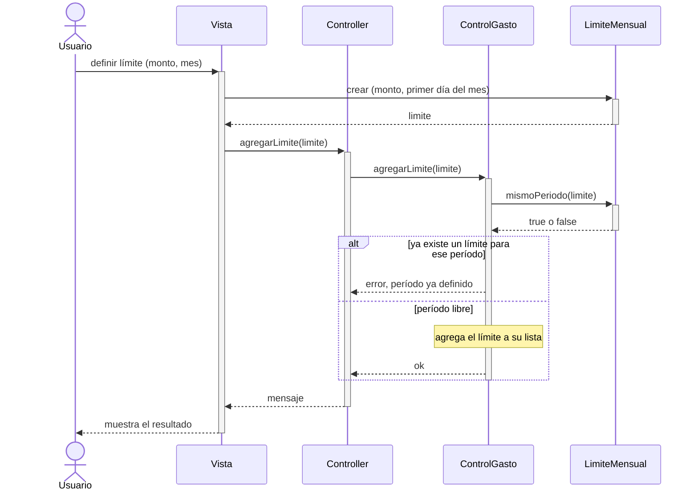

# CU5 – Definir límite

```mermaid
sequenceDiagram
    actor Usuario
    participant Vista
    participant Controller
    participant ControlGasto
    participant LimiteMensual

    Usuario->>+Vista: definir límite (monto, mes)
    Vista->>+LimiteMensual: crear (monto, primer día del mes)
    LimiteMensual-->>-Vista: limite
    Vista->>+Controller: agregarLimite(limite)
    Controller->>+ControlGasto: agregarLimite(limite)
    ControlGasto->>+LimiteMensual: mismoPeriodo(limite)
    LimiteMensual-->>-ControlGasto: true o false

    alt ya existe un límite para ese período
        ControlGasto-->>Controller: error, período ya definido
    else período libre
        Note over ControlGasto: agrega el límite a su lista
        ControlGasto-->>Controller: ok
    end
    deactivate ControlGasto

    Controller-->>-Vista: mensaje
    Vista-->>-Usuario: muestra el resultado
```
