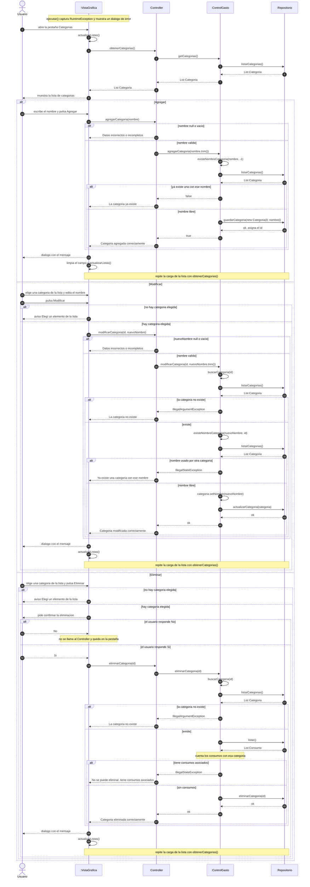

```mermaid
sequenceDiagram
    autonumber
    actor Usuario
    participant V as :VistaGrafica
    participant C as :Controller
    participant CG as :ControlGasto
    participant R as :Repositorio

    Note over V: ejecutar() captura RuntimeException y muestra un dialogo de error

    Usuario->>V: abre la pestaña Categorias
    V->>V: actualizarListas()
    V->>C: obtenerCategorias()
    C->>CG: getCategorias()
    CG->>R: listarCategorias()
    R-->>CG: List Categoria
    CG-->>C: List Categoria
    C-->>V: List Categoria
    V-->>Usuario: muestra la lista de categorias

    alt Agregar
        Usuario->>V: escribe el nombre y pulsa Agregar
        V->>C: agregarCategoria(nombre)
        alt nombre null o vacio
            C-->>V: Datos incorrectos o incompletos
        else nombre valido
            C->>CG: agregarCategoria(nombre.trim())
            CG->>CG: existeNombreCategoria(nombre, -1)
            CG->>R: listarCategorias()
            R-->>CG: List Categoria
            alt ya existe una con ese nombre
                CG-->>C: false
                C-->>V: La categoria ya existe
            else nombre libre
                CG->>R: guardarCategoria(new Categoria(0, nombre))
                R-->>CG: ok, asigna el id
                CG-->>C: true
                C-->>V: Categoria agregada correctamente
            end
        end
        V-->>Usuario: dialogo con el mensaje
        V->>V: limpia el campo y actualizarListas()
        Note over V,R: repite la carga de la lista con obtenerCategorias()

    else Modificar
        Usuario->>V: elige una categoria de la lista y edita el nombre
        Usuario->>V: pulsa Modificar
        alt no hay categoria elegida
            V-->>Usuario: aviso Elegí un elemento de la lista
        else hay categoria elegida
            V->>C: modificarCategoria(id, nuevoNombre)
            alt nuevoNombre null o vacio
                C-->>V: Datos incorrectos o incompletos
            else nombre valido
                C->>CG: modificarCategoria(id, nuevoNombre.trim())
                CG->>CG: buscarCategoria(id)
                CG->>R: listarCategorias()
                R-->>CG: List Categoria
                alt la categoria no existe
                    CG-->>C: IllegalArgumentException
                    C-->>V: La categoria no existe
                else existe
                    CG->>CG: existeNombreCategoria(nuevoNombre, id)
                    CG->>R: listarCategorias()
                    R-->>CG: List Categoria
                    alt nombre usado por otra categoria
                        CG-->>C: IllegalStateException
                        C-->>V: Ya existe una categoria con ese nombre
                    else nombre libre
                        CG->>CG: categoria.setNombre(nuevoNombre)
                        CG->>R: actualizarCategoria(categoria)
                        R-->>CG: ok
                        CG-->>C: ok
                        C-->>V: Categoria modificada correctamente
                    end
                end
            end
            V-->>Usuario: dialogo con el mensaje
            V->>V: actualizarListas()
            Note over V,R: repite la carga de la lista con obtenerCategorias()
        end

    else Eliminar
        Usuario->>V: elige una categoria de la lista y pulsa Eliminar
        alt no hay categoria elegida
            V-->>Usuario: aviso Elegí un elemento de la lista
        else hay categoria elegida
            V-->>Usuario: pide confirmar la eliminacion
            alt el usuario responde No
                Usuario-->>V: No
                Note over V: no se llama al Controller y queda en la pestaña
            else el usuario responde Si
                Usuario-->>V: Si
                V->>C: eliminarCategoria(id)
                C->>CG: eliminarCategoria(id)
                CG->>CG: buscarCategoria(id)
                CG->>R: listarCategorias()
                R-->>CG: List Categoria
                alt la categoria no existe
                    CG-->>C: IllegalArgumentException
                    C-->>V: La categoria no existe
                else existe
                    CG->>R: listar()
                    R-->>CG: List Consumo
                    Note over CG: cuenta los consumos con esa categoria
                    alt tiene consumos asociados
                        CG-->>C: IllegalStateException
                        C-->>V: No se puede eliminar, tiene consumos asociados
                    else sin consumos
                        CG->>R: eliminarCategoria(id)
                        R-->>CG: ok
                        CG-->>C: ok
                        C-->>V: Categoria eliminada correctamente
                    end
                end
                V-->>Usuario: dialogo con el mensaje
                V->>V: actualizarListas()
                Note over V,R: repite la carga de la lista con obtenerCategorias()
            end
        end
    end
```