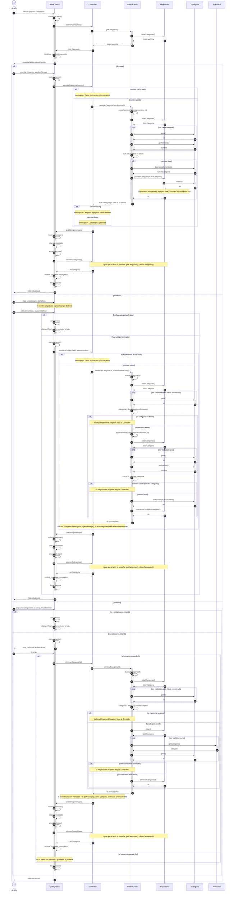

```mermaid
sequenceDiagram
    autonumber
    actor Usuario
    participant V as :VistaGrafica
    participant C as :Controller
    participant CG as :ControlGasto
    participant R as :Repositorio
    participant CAT as :Categoria
    participant CON as :Consumo

    Usuario->>+V: abre la pestaña Categorias
    V->>+V: actualizarListas()
    V->>+C: obtenerCategorias()
    C->>+CG: getCategorias()
    CG->>+R: listarCategorias()
    R-->>-CG: List Categoria
    CG-->>-C: List Categoria
    C-->>-V: List Categoria
    V-->>-V: modelo y combos recargados
    V-->>-Usuario: muestra la lista de categorias

    alt Agregar
        Usuario->>+V: escribe el nombre y pulsa Agregar
        V->>+V: ejecutar(accion)
        V->>+C: agregarCategoria(nombre)
        alt nombre null o vacio
            Note over C: mensajes = Datos incorrectos o incompletos
        else nombre valido
            C->>+CG: agregarCategoria(nombre.trim())
            CG->>+CG: existeNombreCategoria(nombre, -1)
            CG->>+R: listarCategorias()
            R-->>-CG: List Categoria
            loop por cada categoria
                CG->>+CAT: getId()
                CAT-->>-CG: id
                CG->>+CAT: getNombre()
                CAT-->>-CG: nombre
            end
            CG-->>-CG: true si el nombre ya existe
            alt nombre libre
                CG->>+CAT: Categoria(0, nombre)
                CAT-->>-CG: nuevaCategoria
                CG->>+R: guardarCategoria(nuevaCategoria)
                R->>+CAT: setId(id)
                CAT-->>-R: ok
                Note over R: siguienteIdCategoria() y agregarLinea() escriben en categorias.csv
                R-->>-CG: ok
            end
            CG-->>-C: true si la agrego, false si ya existia
            alt devolvio true
                Note over C: mensajes = Categoria agregada correctamente
            else devolvio false
                Note over C: mensajes = La categoria ya existe
            end
        end
        C-->>-V: List String mensajes
        V->>+V: mostrar(mensajes)
        V-->>-V: dialogo mostrado
        V->>+V: actualizarListas()
        V->>+C: obtenerCategorias()
        Note over C,R: igual que al abrir la pestaña: getCategorias() y listarCategorias()
        C-->>-V: List Categoria
        V-->>-V: modelo y combos recargados
        V-->>-V: fin de ejecutar
        V-->>-Usuario: lista actualizada

    else Modificar
        Usuario->>V: elige una categoria de la lista
        Note over V: el nombre elegido se copia al campo de texto
        Usuario->>+V: edita el nombre y pulsa Modificar
        alt no hay categoria elegida
            V->>+V: aviso(texto)
            V-->>-V: dialogo Elegí un elemento de la lista
        else hay categoria elegida
            V->>+V: ejecutar(accion)
            V->>+C: modificarCategoria(id, nuevoNombre)
            alt nuevoNombre null o vacio
                Note over C: mensajes = Datos incorrectos o incompletos
            else nombre valido
                C->>+CG: modificarCategoria(id, nuevoNombre.trim())
                CG->>+CG: buscarCategoria(id)
                CG->>+R: listarCategorias()
                R-->>-CG: List Categoria
                loop por cada categoria hasta encontrarla
                    CG->>+CAT: getId()
                    CAT-->>-CG: id
                end
                CG-->>-CG: categoria o IllegalArgumentException
                alt la categoria no existe
                    Note over CG,C: la IllegalArgumentException llega al Controller
                else la categoria existe
                    CG->>+CG: existeNombreCategoria(nuevoNombre, id)
                    CG->>+R: listarCategorias()
                    R-->>-CG: List Categoria
                    loop por cada categoria
                        CG->>+CAT: getId()
                        CAT-->>-CG: id
                        CG->>+CAT: getNombre()
                        CAT-->>-CG: nombre
                    end
                    CG-->>-CG: true si lo usa otra categoria
                    alt nombre usado por otra categoria
                        Note over CG,C: la IllegalStateException llega al Controller
                    else nombre libre
                        CG->>+CAT: setNombre(nuevoNombre)
                        CAT-->>-CG: ok
                        CG->>+R: actualizarCategoria(categoria)
                        R-->>-CG: ok
                    end
                end
                CG-->>-C: ok o excepcion
                Note over C: si hubo excepcion mensajes = e.getMessage(), si no Categoria modificada correctamente
            end
            C-->>-V: List String mensajes
            V->>+V: mostrar(mensajes)
            V-->>-V: dialogo mostrado
            V->>+V: actualizarListas()
            V->>+C: obtenerCategorias()
            Note over C,R: igual que al abrir la pestaña: getCategorias() y listarCategorias()
            C-->>-V: List Categoria
            V-->>-V: modelo y combos recargados
            V-->>-V: fin de ejecutar
        end
        V-->>-Usuario: lista actualizada

    else Eliminar
        Usuario->>+V: elige una categoria de la lista y pulsa Eliminar
        alt no hay categoria elegida
            V->>+V: aviso(texto)
            V-->>-V: dialogo Elegí un elemento de la lista
        else hay categoria elegida
            V->>+V: ejecutar(accion)
            V-->>Usuario: pide confirmar la eliminacion
            Usuario-->>V: Si o No
            alt el usuario responde Si
                V->>+C: eliminarCategoria(id)
                C->>+CG: eliminarCategoria(id)
                CG->>+CG: buscarCategoria(id)
                CG->>+R: listarCategorias()
                R-->>-CG: List Categoria
                loop por cada categoria hasta encontrarla
                    CG->>+CAT: getId()
                    CAT-->>-CG: id
                end
                CG-->>-CG: categoria o IllegalArgumentException
                alt la categoria no existe
                    Note over CG,C: la IllegalArgumentException llega al Controller
                else la categoria existe
                    CG->>+R: listar()
                    R-->>-CG: List Consumo
                    loop por cada consumo
                        CG->>+CON: getCategoria()
                        CON-->>-CG: categoria
                        CG->>+CAT: getId()
                        CAT-->>-CG: id
                    end
                    alt tiene consumos asociados
                        Note over CG,C: la IllegalStateException llega al Controller
                    else sin consumos asociados
                        CG->>+R: eliminarCategoria(id)
                        R-->>-CG: ok
                    end
                end
                CG-->>-C: ok o excepcion
                Note over C: si hubo excepcion mensajes = e.getMessage(), si no Categoria eliminada correctamente
                C-->>-V: List String mensajes
                V->>+V: mostrar(mensajes)
                V-->>-V: dialogo mostrado
                V->>+V: actualizarListas()
                V->>+C: obtenerCategorias()
                Note over C,R: igual que al abrir la pestaña: getCategorias() y listarCategorias()
                C-->>-V: List Categoria
                V-->>-V: modelo y combos recargados
            else el usuario responde No
                Note over V: no se llama al Controller y queda en la pestaña
            end
            V-->>-V: fin de ejecutar
        end
        V-->>-Usuario: lista actualizada
    end
```
