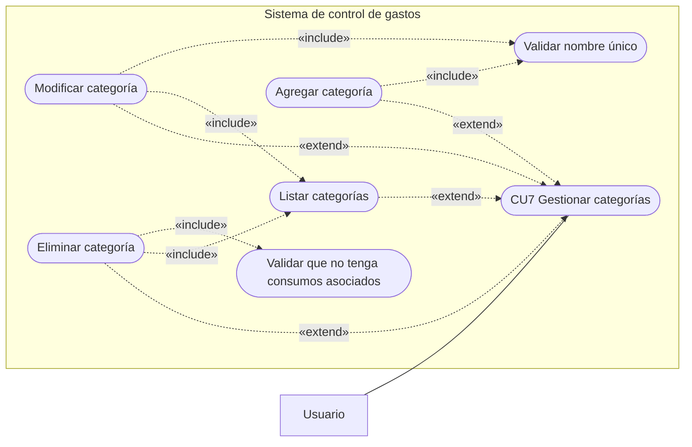

```mermaid
flowchart LR
    U["Usuario"]

    subgraph SIS["Sistema de control de gastos"]
        CU7(["CU7 Gestionar categorías"])
        L(["Listar categorías"])
        A(["Agregar categoría"])
        M(["Modificar categoría"])
        E(["Eliminar categoría"])
        VN(["Validar nombre único"])
        VC(["Validar que no tenga consumos asociados"])
    end

    U --- CU7

    L -.->|"«extend»"| CU7
    A -.->|"«extend»"| CU7
    M -.->|"«extend»"| CU7
    E -.->|"«extend»"| CU7

    M -.->|"«include»"| L
    E -.->|"«include»"| L
    A -.->|"«include»"| VN
    M -.->|"«include»"| VN
    E -.->|"«include»"| VC
```