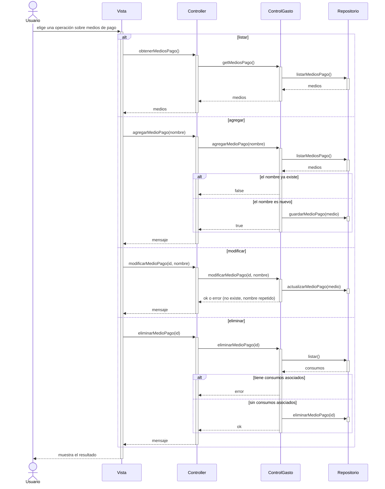

## CU8 – Gestionar medios de pago

```mermaid
sequenceDiagram
    actor Usuario
    participant Vista
    participant Controller
    participant ControlGasto
    participant Repositorio

    Usuario->>+Vista: elige una operación sobre medios de pago

    alt listar
        Vista->>+Controller: obtenerMediosPago()
        Controller->>+ControlGasto: getMediosPago()
        ControlGasto->>+Repositorio: listarMediosPago()
        Repositorio-->>-ControlGasto: medios
        ControlGasto-->>-Controller: medios
        Controller-->>-Vista: medios
    else agregar
        Vista->>+Controller: agregarMedioPago(nombre)
        Controller->>+ControlGasto: agregarMedioPago(nombre)
        ControlGasto->>+Repositorio: listarMediosPago()
        Repositorio-->>-ControlGasto: medios
        alt el nombre ya existe
            ControlGasto-->>Controller: false
        else el nombre es nuevo
            ControlGasto->>+Repositorio: guardarMedioPago(medio)
            deactivate Repositorio
            ControlGasto-->>Controller: true
        end
        deactivate ControlGasto
        Controller-->>Vista: mensaje
        deactivate Controller
    else modificar
        Vista->>+Controller: modificarMedioPago(id, nombre)
        Controller->>+ControlGasto: modificarMedioPago(id, nombre)
        ControlGasto->>+Repositorio: actualizarMedioPago(medio)
        deactivate Repositorio
        ControlGasto-->>Controller: ok o error (no existe, nombre repetido)
        deactivate ControlGasto
        Controller-->>Vista: mensaje
        deactivate Controller
    else eliminar
        Vista->>+Controller: eliminarMedioPago(id)
        Controller->>+ControlGasto: eliminarMedioPago(id)
        ControlGasto->>+Repositorio: listar()
        Repositorio-->>-ControlGasto: consumos
        alt tiene consumos asociados
            ControlGasto-->>Controller: error
        else sin consumos asociados
            ControlGasto->>+Repositorio: eliminarMedioPago(id)
            deactivate Repositorio
            ControlGasto-->>Controller: ok
        end
        deactivate ControlGasto
        Controller-->>Vista: mensaje
        deactivate Controller
    end

    Vista-->>-Usuario: muestra el resultado
```
