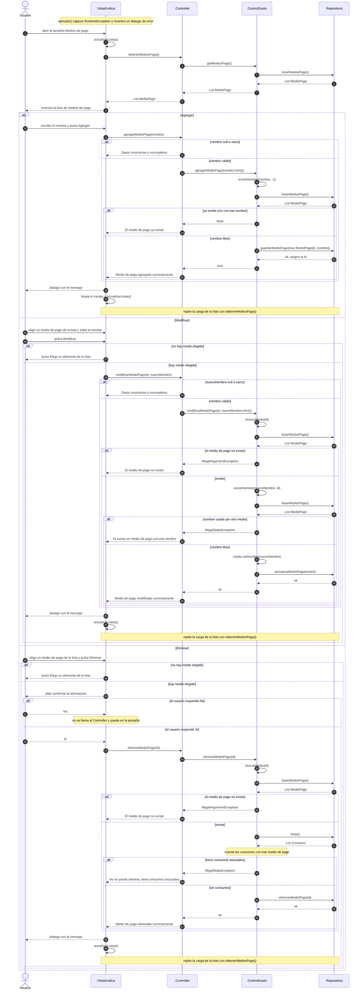

```mermaid
sequenceDiagram
    autonumber
    actor Usuario
    participant V as :VistaGrafica
    participant C as :Controller
    participant CG as :ControlGasto
    participant R as :Repositorio

    Note over V: ejecutar() captura RuntimeException y muestra un dialogo de error

    Usuario->>V: abre la pestaña Medios de pago
    V->>V: actualizarListas()
    V->>C: obtenerMediosPago()
    C->>CG: getMediosPago()
    CG->>R: listarMediosPago()
    R-->>CG: List MedioPago
    CG-->>C: List MedioPago
    C-->>V: List MedioPago
    V-->>Usuario: muestra la lista de medios de pago

    alt Agregar
        Usuario->>V: escribe el nombre y pulsa Agregar
        V->>C: agregarMedioPago(nombre)
        alt nombre null o vacio
            C-->>V: Datos incorrectos o incompletos
        else nombre valido
            C->>CG: agregarMedioPago(nombre.trim())
            CG->>CG: existeNombre(nombre, -1)
            CG->>R: listarMediosPago()
            R-->>CG: List MedioPago
            alt ya existe uno con ese nombre
                CG-->>C: false
                C-->>V: El medio de pago ya existe
            else nombre libre
                CG->>R: guardarMedioPago(new MedioPago(0, nombre))
                R-->>CG: ok, asigna el id
                CG-->>C: true
                C-->>V: Medio de pago agregado correctamente
            end
        end
        V-->>Usuario: dialogo con el mensaje
        V->>V: limpia el campo y actualizarListas()
        Note over V,R: repite la carga de la lista con obtenerMediosPago()

    else Modificar
        Usuario->>V: elige un medio de pago de la lista y edita el nombre
        Usuario->>V: pulsa Modificar
        alt no hay medio elegido
            V-->>Usuario: aviso Elegí un elemento de la lista
        else hay medio elegido
            V->>C: modificarMedioPago(id, nuevoNombre)
            alt nuevoNombre null o vacio
                C-->>V: Datos incorrectos o incompletos
            else nombre valido
                C->>CG: modificarMedioPago(id, nuevoNombre.trim())
                CG->>CG: buscarMedio(id)
                CG->>R: listarMediosPago()
                R-->>CG: List MedioPago
                alt el medio de pago no existe
                    CG-->>C: IllegalArgumentException
                    C-->>V: El medio de pago no existe
                else existe
                    CG->>CG: existeNombre(nuevoNombre, id)
                    CG->>R: listarMediosPago()
                    R-->>CG: List MedioPago
                    alt nombre usado por otro medio
                        CG-->>C: IllegalStateException
                        C-->>V: Ya existe un medio de pago con ese nombre
                    else nombre libre
                        CG->>CG: medio.setNombre(nuevoNombre)
                        CG->>R: actualizarMedioPago(medio)
                        R-->>CG: ok
                        CG-->>C: ok
                        C-->>V: Medio de pago modificado correctamente
                    end
                end
            end
            V-->>Usuario: dialogo con el mensaje
            V->>V: actualizarListas()
            Note over V,R: repite la carga de la lista con obtenerMediosPago()
        end

    else Eliminar
        Usuario->>V: elige un medio de pago de la lista y pulsa Eliminar
        alt no hay medio elegido
            V-->>Usuario: aviso Elegí un elemento de la lista
        else hay medio elegido
            V-->>Usuario: pide confirmar la eliminacion
            alt el usuario responde No
                Usuario-->>V: No
                Note over V: no se llama al Controller y queda en la pestaña
            else el usuario responde Si
                Usuario-->>V: Si
                V->>C: eliminarMedioPago(id)
                C->>CG: eliminarMedioPago(id)
                CG->>CG: buscarMedio(id)
                CG->>R: listarMediosPago()
                R-->>CG: List MedioPago
                alt el medio de pago no existe
                    CG-->>C: IllegalArgumentException
                    C-->>V: El medio de pago no existe
                else existe
                    CG->>R: listar()
                    R-->>CG: List Consumo
                    Note over CG: cuenta los consumos con ese medio de pago
                    alt tiene consumos asociados
                        CG-->>C: IllegalStateException
                        C-->>V: No se puede eliminar, tiene consumos asociados
                    else sin consumos
                        CG->>R: eliminarMedioPago(id)
                        R-->>CG: ok
                        CG-->>C: ok
                        C-->>V: Medio de pago eliminado correctamente
                    end
                end
                V-->>Usuario: dialogo con el mensaje
                V->>V: actualizarListas()
                Note over V,R: repite la carga de la lista con obtenerMediosPago()
            end
        end
    end
```