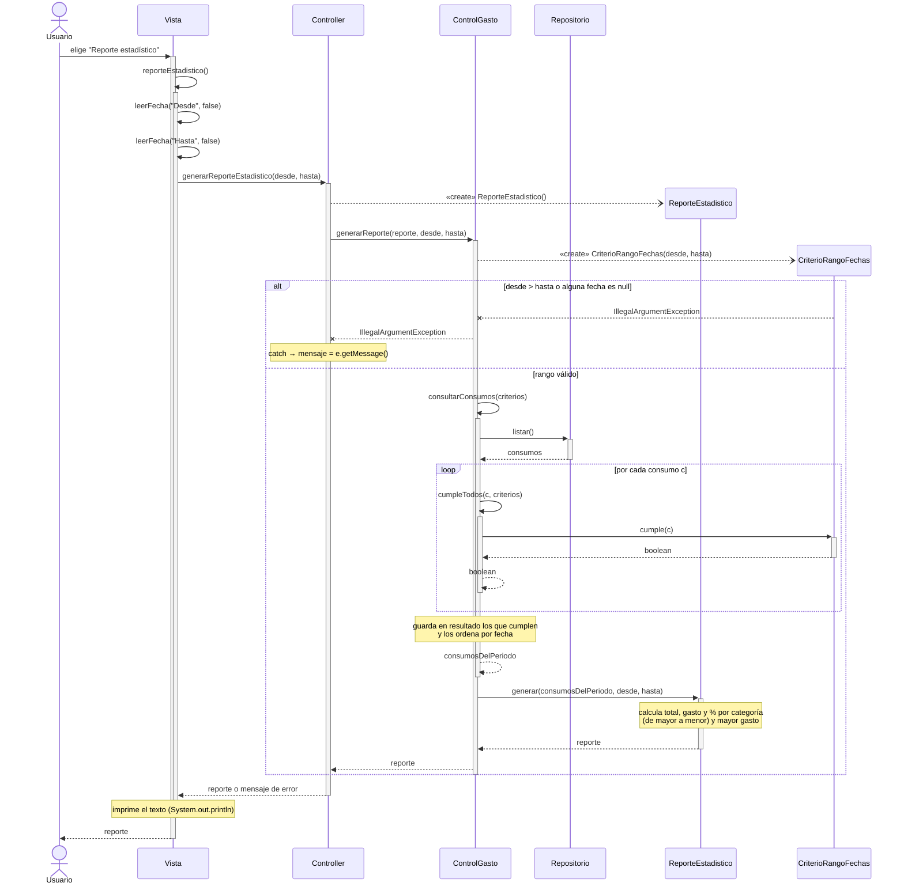

# CU9 – Consultar reporte estadístico

```mermaid
sequenceDiagram
    actor Usuario
    participant Vista
    participant Controller
    participant ControlGasto
    participant Repositorio

    Usuario->>+Vista: elige "Reporte estadístico"
    Vista->>+Vista: reporteEstadistico()
    Vista->>Vista: leerFecha("Desde", false)
    Vista->>Vista: leerFecha("Hasta", false)
    Vista->>+Controller: generarReporteEstadistico(desde, hasta)

    create participant ReporteEstadistico
    Controller--)ReporteEstadistico: «create» ReporteEstadistico()
    Controller->>+ControlGasto: generarReporte(reporte, desde, hasta)

    create participant CriterioRangoFechas
    ControlGasto--)CriterioRangoFechas: «create» CriterioRangoFechas(desde, hasta)

    alt desde > hasta o alguna fecha es null
        CriterioRangoFechas--xControlGasto: IllegalArgumentException
        ControlGasto--xController: IllegalArgumentException
        Note over Controller: catch → mensaje = e.getMessage()
    else rango válido
        ControlGasto->>+ControlGasto: consultarConsumos(criterios)
        ControlGasto->>+Repositorio: listar()
        Repositorio-->>-ControlGasto: consumos
        loop por cada consumo c
            ControlGasto->>+ControlGasto: cumpleTodos(c, criterios)
            ControlGasto->>+CriterioRangoFechas: cumple(c)
            CriterioRangoFechas-->>-ControlGasto: boolean
            ControlGasto-->>-ControlGasto: boolean
        end
        Note over ControlGasto: guarda en resultado los que cumplen<br/>y los ordena por fecha
        ControlGasto-->>-ControlGasto: consumosDelPeriodo

        ControlGasto->>+ReporteEstadistico: generar(consumosDelPeriodo, desde, hasta)
        Note over ReporteEstadistico: calcula total, gasto y % por categoría<br/>(de mayor a menor) y mayor gasto
        ReporteEstadistico-->>-ControlGasto: reporte
        ControlGasto-->>Controller: reporte
    end
    deactivate ControlGasto

    Controller-->>-Vista: reporte o mensaje de error
    Note over Vista: imprime el texto (System.out.println)
    deactivate Vista
    Vista-->>-Usuario: reporte
```

