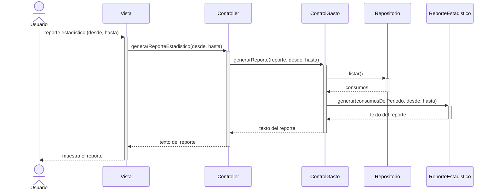

## CU9 – Consultar reporte estadístico

```mermaid
sequenceDiagram
    actor Usuario
    participant Vista
    participant Controller
    participant ControlGasto
    participant Repositorio
    participant ReporteEstadistico

    Usuario->>+Vista: reporte estadístico (desde, hasta)
    Vista->>+Controller: generarReporteEstadistico(desde, hasta)
    Controller->>+ControlGasto: generarReporte(reporte, desde, hasta)
    ControlGasto->>+Repositorio: listar()
    Repositorio-->>-ControlGasto: consumos
    ControlGasto->>+ReporteEstadistico: generar(consumosDelPeriodo, desde, hasta)
    ReporteEstadistico-->>-ControlGasto: texto del reporte
    ControlGasto-->>-Controller: texto del reporte
    Controller-->>-Vista: texto del reporte
    Vista-->>-Usuario: muestra el reporte
```
