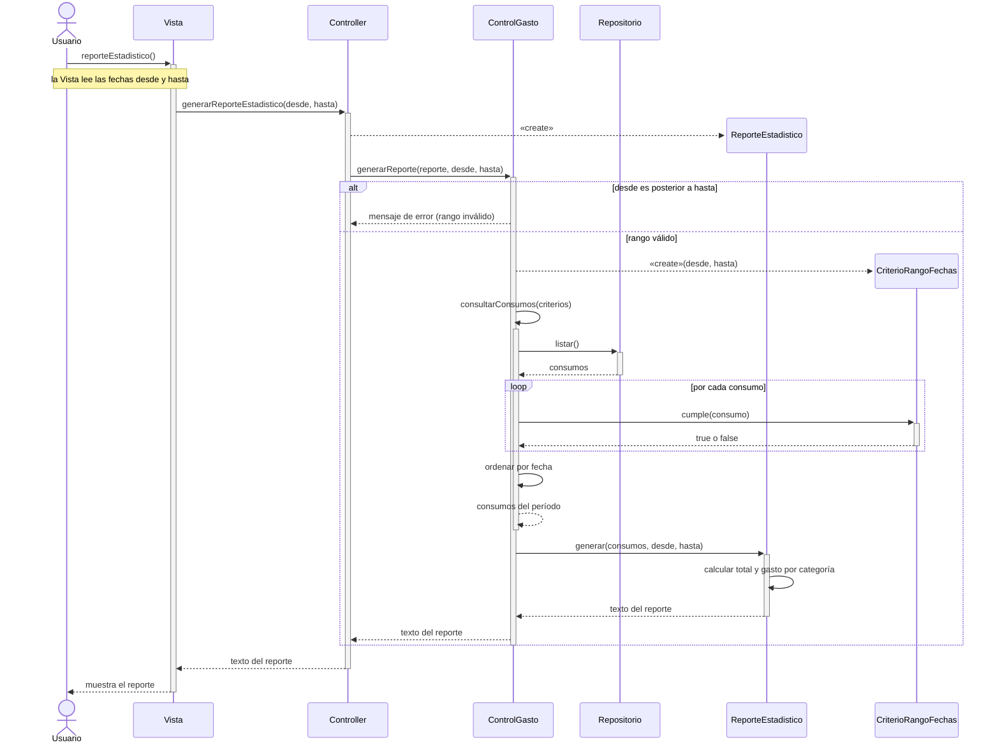

# CU9 – Consultar reporte estadístico

```mermaid
sequenceDiagram
    actor Usuario
    participant Vista
    participant Controller
    participant ControlGasto
    participant Repositorio

    Usuario->>+Vista: reporteEstadistico()
    Note over Usuario,Vista: la Vista lee las fechas desde y hasta
    Vista->>+Controller: generarReporteEstadistico(desde, hasta)
    create participant ReporteEstadistico
    Controller-->>ReporteEstadistico: «create»
    Controller->>+ControlGasto: generarReporte(reporte, desde, hasta)

    alt desde es posterior a hasta
        ControlGasto-->>Controller: mensaje de error (rango inválido)
    else rango válido
        create participant CriterioRangoFechas
        ControlGasto-->>CriterioRangoFechas: «create»(desde, hasta)
        ControlGasto->>+ControlGasto: consultarConsumos(criterios)
        ControlGasto->>+Repositorio: listar()
        Repositorio-->>-ControlGasto: consumos
        loop por cada consumo
            ControlGasto->>+CriterioRangoFechas: cumple(consumo)
            CriterioRangoFechas-->>-ControlGasto: true o false
        end
        ControlGasto->>ControlGasto: ordenar por fecha
        ControlGasto-->>-ControlGasto: consumos del período
        ControlGasto->>+ReporteEstadistico: generar(consumos, desde, hasta)
        ReporteEstadistico->>ReporteEstadistico: calcular total y gasto por categoría
        ReporteEstadistico-->>-ControlGasto: texto del reporte
        ControlGasto-->>Controller: texto del reporte
    end
    deactivate ControlGasto

    Controller-->>-Vista: texto del reporte
    Vista-->>-Usuario: muestra el reporte
```
