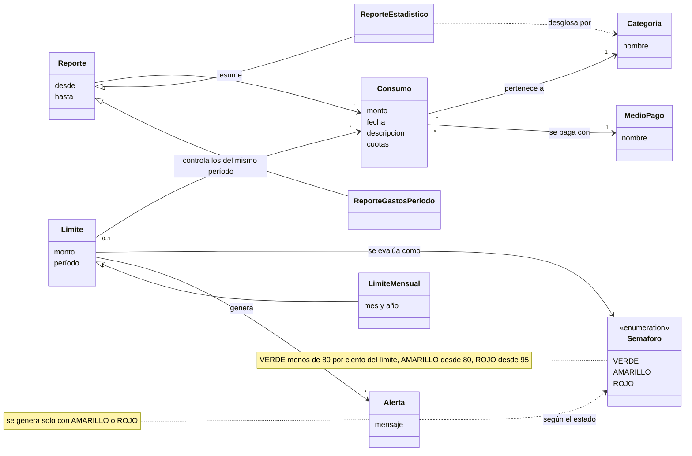

```mermaid
classDiagram
    direction LR

    class Consumo {
        monto
        fecha
        descripcion
        cuotas
    }
    class Categoria {
        nombre
    }
    class MedioPago {
        nombre
    }
    class Limite {
        monto
        período
    }
    class LimiteMensual {
        mes y año
    }
    class Semaforo {
        <<enumeration>>
        VERDE
        AMARILLO
        ROJO
    }
    class Alerta {
        mensaje
    }
    class Reporte {
        desde
        hasta
    }
    class ReporteEstadistico
    class ReporteGastosPeriodo

    note for Semaforo "VERDE menos de 80 por ciento del límite, AMARILLO desde 80, ROJO desde 95"
    note for Alerta "se genera solo con AMARILLO o ROJO"

    Consumo "*" --> "1" Categoria : pertenece a
    Consumo "*" --> "1" MedioPago : se paga con
    Limite "0..1" --> "*" Consumo : controla los del mismo período
    Limite --> Semaforo : se evalúa como
    Limite "1" --> "*" Alerta : genera
    Alerta ..> Semaforo : según el estado
    Limite <|-- LimiteMensual
    Reporte "1" --> "*" Consumo : resume
    Reporte <|-- ReporteEstadistico
    Reporte <|-- ReporteGastosPeriodo
    ReporteEstadistico ..> Categoria : desglosa por
```
