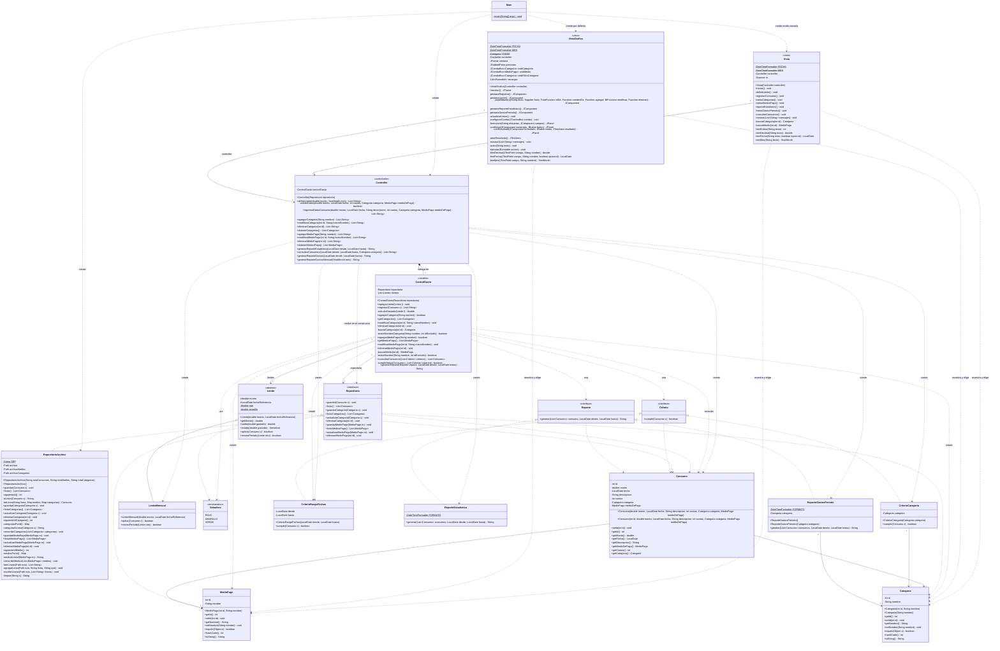

```mermaid
classDiagram
    direction TB

    class Main {
        +main(String[] args) void$
    }

    class Vista {
        <<vista>>
        -DateTimeFormatter FECHA$
        -DateTimeFormatter MES$
        -Controller controller
        -Scanner in
        +Vista(Controller controller)
        +iniciar() void
        -definirLimite() void
        -registrarConsumo() void
        -menuCategorias() void
        -menuMediosPago() void
        -reporteEstadistico() void
        -menuGastosPeriodo() void
        -consultarConsumos() void
        -mostrar(List~String~ mensajes) void
        -buscarCategoria(int id) Categoria
        -buscarMedio(int id) MedioPago
        -leerEntero(String texto) int
        -leerDecimal(String texto) double
        -leerFecha(String texto, boolean opcional) LocalDate
        -leerMes(String texto) YearMonth
    }

    class VistaGrafica {
        <<vista>>
        -DateTimeFormatter FECHA$
        -DateTimeFormatter MES$
        -Categoria TODAS$
        -Controller controller
        -JFrame ventana
        -JTabbedPane pestanas
        -JComboBox~Categoria~ cmbCategoria
        -JComboBox~MedioPago~ cmbMedio
        -JComboBox~Categoria~ cmbFiltroCategoria
        -List~Runnable~ recargas
        +VistaGrafica(Controller controller)
        +mostrar() JFrame
        -pestanaRegistrar() JComponent
        -pestanaLimite() JComponent
        -panelMaestro(String titulo, Supplier listar, ToIntFunction idDe, Function nombreDe, Function agregar, BiFunction modificar, Function eliminar) JComponent
        -pestanaReporteEstadistico() JComponent
        -pestanaGastosPeriodo() JComponent
        -actualizarListas() void
        -configurarCombo(JComboBox combo) void
        -formulario(String etiquetas, JComponent campos) JPanel
        -conBoton(JComponent contenido, JButton boton) JPanel
        -conResultado(JComponent formulario, JButton boton, JTextArea resultado) JPanel
        -areaResultado() JTextArea
        -mostrar(List~String~ mensajes) void
        -aviso(String texto) void
        -ejecutar(Runnable accion) void
        -leerDecimal(JTextField campo, String nombre) double
        -leerFecha(JTextField campo, String nombre, boolean opcional) LocalDate
        -leerMes(JTextField campo, String nombre) YearMonth
    }

    class Controller {
        <<controlador>>
        -ControlGasto controlGasto
        +Controller(Repositorio repositorio)
        +definirLimite(double monto, YearMonth mes) List~String~
        -validarDatos(double monto, LocalDate fecha, int cuotas, Categoria categoria, MedioPago medioDePago) boolean
        +ingresarDatosConsumo(double monto, LocalDate fecha, String descripcion, int cuotas, Categoria categoria, MedioPago medioDePago) List~String~
        +agregarCategoria(String nombre) List~String~
        +modificarCategoria(int id, String nuevoNombre) List~String~
        +eliminarCategoria(int id) List~String~
        +obtenerCategorias() List~Categoria~
        +agregarMedioPago(String nombre) List~String~
        +modificarMedioPago(int id, String nuevoNombre) List~String~
        +eliminarMedioPago(int id) List~String~
        +obtenerMediosPago() List~MedioPago~
        +generarReporteEstadistico(LocalDate desde, LocalDate hasta) String
        +consultarConsumos(LocalDate desde, LocalDate hasta, Categoria categoria) List~String~
        +generarReporteGastos(LocalDate desde, LocalDate hasta) String
        +generarReporteGastosMensual(YearMonth mes) String
    }

    class ControlGasto {
        <<modelo>>
        -Repositorio repositorio
        -List~Limite~ limites
        +ControlGasto(Repositorio repositorio)
        +agregarLimite(Limite l) void
        +registrar(Consumo c) List~String~
        -calcularGastado(Limite l) double
        +agregarCategoria(String nombre) boolean
        +getCategorias() List~Categoria~
        +modificarCategoria(int id, String nuevoNombre) void
        +eliminarCategoria(int id) void
        -buscarCategoria(int id) Categoria
        -existeNombreCategoria(String nombre, int idExcluido) boolean
        +agregarMedioPago(String nombre) boolean
        +getMediosPago() List~MedioPago~
        +modificarMedioPago(int id, String nuevoNombre) void
        +eliminarMedioPago(int id) void
        -buscarMedio(int id) MedioPago
        -existeNombre(String nombre, int idExcluido) boolean
        +consultarConsumos(List~Criterio~ criterios) List~Consumo~
        -cumpleTodos(Consumo c, List~Criterio~ criterios) boolean
        +generarReporte(Reporte reporte, LocalDate desde, LocalDate hasta) String
    }

    class Repositorio {
        <<interface>>
        +guardar(Consumo c) void
        +listar() List~Consumo~
        +guardarCategoria(Categoria c) void
        +listarCategorias() List~Categoria~
        +actualizarCategoria(Categoria c) void
        +eliminarCategoria(int id) void
        +guardarMedioPago(MedioPago m) void
        +listarMediosPago() List~MedioPago~
        +actualizarMedioPago(MedioPago m) void
        +eliminarMedioPago(int id) void
    }

    class RepositorioArchivo {
        -String SEP$
        -Path archivo
        -Path archivoMedios
        -Path archivoCategorias
        +RepositorioArchivo(String rutaConsumos, String rutaMedios, String rutaCategorias)
        +RepositorioArchivo()
        +guardar(Consumo c) void
        +listar() List~Consumo~
        -siguienteId() int
        -aLinea(Consumo c) String
        -deLinea(String linea, Map medios, Map categorias) Consumo
        +guardarCategoria(Categoria c) void
        +listarCategorias() List~Categoria~
        +actualizarCategoria(Categoria c) void
        +eliminarCategoria(int id) void
        -siguienteIdCategoria() int
        -categoriasPorId() Map
        -categoriaALinea(Categoria c) String
        -reescribirCategorias(List~Categoria~ categorias) void
        +guardarMedioPago(MedioPago m) void
        +listarMediosPago() List~MedioPago~
        +actualizarMedioPago(MedioPago m) void
        +eliminarMedioPago(int id) void
        -siguienteIdMedio() int
        -mediosPorId() Map
        -medioALinea(MedioPago m) String
        -reescribirMedios(List~MedioPago~ medios) void
        -leerLineas(Path ruta) List~String~
        -agregarLinea(Path ruta, String linea, String que) void
        -escribirLineas(Path ruta, List~String~ lineas) void
        -limpiar(String s) String
    }

    class Categoria {
        -int id
        -String nombre
        +Categoria(int id, String nombre)
        +Categoria(String nombre)
        +getId() int
        +setId(int id) void
        +getNombre() String
        +setNombre(String nombre) void
        +equals(Object o) boolean
        +hashCode() int
        +toString() String
    }

    class MedioPago {
        -int id
        -String nombre
        +MedioPago(int id, String nombre)
        +getId() int
        +setId(int id) void
        +getNombre() String
        +setNombre(String nombre) void
        +equals(Object o) boolean
        +hashCode() int
        +toString() String
    }

    class Consumo {
        -int id
        -double monto
        -LocalDate fecha
        -String descripcion
        -int cuotas
        -Categoria categoria
        -MedioPago medioDePago
        +Consumo(double monto, LocalDate fecha, String descripcion, int cuotas, Categoria categoria, MedioPago medioDePago)
        +Consumo(int id, double monto, LocalDate fecha, String descripcion, int cuotas, Categoria categoria, MedioPago medioDePago)
        +setId(int id) void
        +getId() int
        +getMonto() double
        +getFecha() LocalDate
        +getDescripcion() String
        +getMedioDePago() MedioPago
        +getCuotas() int
        +getCategoria() Categoria
    }

    class Limite {
        <<abstract>>
        #double monto
        #LocalDate fechaReferencia
        -double rojo$
        -double amarillo$
        +Limite(double monto, LocalDate fechaReferencia)
        +getMonto() double
        +saldo(double gastado) double
        +estado(double gastado) Semaforo
        +aplica(Consumo c) boolean*
        +mismoPeriodo(Limite otro) boolean*
    }

    class LimiteMensual {
        +LimiteMensual(double monto, LocalDate fechaReferencia)
        +aplica(Consumo c) boolean
        +mismoPeriodo(Limite otro) boolean
    }

    class Semaforo {
        <<enumeration>>
        ROJO
        AMARILLO
        VERDE
    }

    class Criterio {
        <<interface>>
        +cumple(Consumo c) boolean
    }

    class CriterioCategoria {
        -Categoria categoria
        +CriterioCategoria(Categoria categoria)
        +cumple(Consumo c) boolean
    }

    class CriterioRangoFechas {
        -LocalDate desde
        -LocalDate hasta
        +CriterioRangoFechas(LocalDate desde, LocalDate hasta)
        +cumple(Consumo c) boolean
    }

    class Reporte {
        <<interface>>
        +generar(List~Consumo~ consumo, LocalDate desde, LocalDate hasta) String
    }

    class ReporteEstadistico {
        -DateTimeFormatter FORMATO$
        +generar(List~Consumo~ consumos, LocalDate desde, LocalDate hasta) String
    }

    class ReporteGastosPeriodo {
        -DateTimeFormatter FORMATO$
        -Categoria categoria
        +ReporteGastosPeriodo()
        +ReporteGastosPeriodo(Categoria categoria)
        +generar(List~Consumo~ consumos, LocalDate desde, LocalDate hasta) String
    }

    Main ..> Vista : create modo consola
    Main ..> VistaGrafica : create por defecto
    Main ..> Controller : create
    Main ..> RepositorioArchivo : create

    Vista "1" --> "1" Controller : controller
    VistaGrafica "1" --> "1" Controller : controller
    Vista ..> Categoria : muestra y elige
    Vista ..> MedioPago : muestra y elige
    VistaGrafica ..> Categoria : muestra y elige
    VistaGrafica ..> MedioPago : muestra y elige

    Controller "1" *-- "1" ControlGasto : delega en
    Controller ..> Repositorio : recibe en el constructor
    Controller ..> Consumo : create
    Controller ..> LimiteMensual : create
    Controller ..> CriterioRangoFechas : create
    Controller ..> CriterioCategoria : create
    Controller ..> ReporteEstadistico : create
    Controller ..> ReporteGastosPeriodo : create

    ControlGasto "1" --> "1" Repositorio : repositorio
    ControlGasto "1" --> "*" Limite : limites
    ControlGasto ..> Categoria : create
    ControlGasto ..> MedioPago : create
    ControlGasto ..> Consumo : consulta
    ControlGasto ..> Criterio : usa
    ControlGasto ..> CriterioRangoFechas : create
    ControlGasto ..> Reporte : usa
    ControlGasto ..> Semaforo : usa

    Repositorio <|.. RepositorioArchivo
    Repositorio ..> Consumo
    Repositorio ..> Categoria
    Repositorio ..> MedioPago

    Consumo "*" --> "1" Categoria
    Consumo "*" --> "1" MedioPago

    Limite <|-- LimiteMensual
    Limite ..> Semaforo
    Limite ..> Consumo

    Criterio <|.. CriterioCategoria
    Criterio <|.. CriterioRangoFechas
    Criterio ..> Consumo
    CriterioCategoria "1" --> "1" Categoria

    Reporte <|.. ReporteEstadistico
    Reporte <|.. ReporteGastosPeriodo
    Reporte ..> Consumo
    ReporteGastosPeriodo "1" --> "0..1" Categoria
```