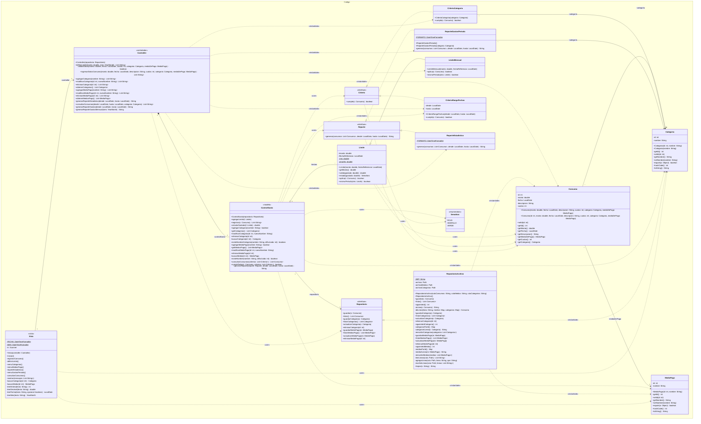

# Diagrama de clases – Gestor de Gastos

```mermaid
classDiagram
    direction TB

    namespace Codigo {
        class Vista {
            <<vista>>
            -FECHA: DateTimeFormatter$
            -MES: DateTimeFormatter$
            -in: Scanner
            +Vista(controller: Controller)
            +iniciar()
            -registrarConsumo()
            -definirLimite()
            -menuCategorias()
            -menuMediosPago()
            -reporteEstadistico()
            -menuGastosPeriodo()
            -consultarConsumos()
            -mostrar(mensajes: List~String~)
            -buscarCategoria(id: int) Categoria
            -buscarMedio(id: int) MedioPago
            -leerEntero(texto: String) int
            -leerDecimal(texto: String) double
            -leerFecha(texto: String, opcional: boolean) LocalDate
            -leerMes(texto: String) YearMonth
        }

        class Controller {
            <<controlador>>
            +Controller(repositorio: Repositorio)
            +definirLimite(monto: double, mes: YearMonth) List~String~
            -validarDatos(monto: double, fecha: LocalDate, cuotas: int, categoria: Categoria, medioDePago: MedioPago) boolean
            +ingresarDatosConsumo(monto: double, fecha: LocalDate, descripcion: String, cuotas: int, categoria: Categoria, medioDePago: MedioPago) List~String~
            +agregarCategoria(nombre: String) List~String~
            +modificarCategoria(id: int, nuevoNombre: String) List~String~
            +eliminarCategoria(id: int) List~String~
            +obtenerCategorias() List~Categoria~
            +agregarMedioPago(nombre: String) List~String~
            +modificarMedioPago(id: int, nuevoNombre: String) List~String~
            +eliminarMedioPago(id: int) List~String~
            +obtenerMediosPago() List~MedioPago~
            +generarReporteEstadistico(desde: LocalDate, hasta: LocalDate) String
            +consultarConsumos(desde: LocalDate, hasta: LocalDate, categoria: Categoria) List~String~
            +generarReporteGastos(desde: LocalDate, hasta: LocalDate) String
            +generarReporteGastosMensual(mes: YearMonth) String
        }

        class ControlGasto {
            <<modelo>>
            +ControlGasto(repositorio: Repositorio)
            +agregarLimite(l: Limite)
            +registrar(c: Consumo) List~String~
            -calcularGastado(l: Limite) double
            +agregarCategoria(nombre: String) boolean
            +getCategorias() List~Categoria~
            +modificarCategoria(id: int, nuevoNombre: String)
            +eliminarCategoria(id: int)
            -buscarCategoria(id: int) Categoria
            -existeNombreCategoria(nombre: String, idExcluido: int) boolean
            +agregarMedioPago(nombre: String) boolean
            +getMediosPago() List~MedioPago~
            +modificarMedioPago(id: int, nuevoNombre: String)
            +eliminarMedioPago(id: int)
            -buscarMedio(id: int) MedioPago
            -existeNombre(nombre: String, idExcluido: int) boolean
            +consultarConsumos(criterios: List~Criterio~) List~Consumo~
            -cumpleTodos(c: Consumo, criterios: List~Criterio~) boolean
            +generarReporte(reporte: Reporte, desde: LocalDate, hasta: LocalDate) String
        }

        class Repositorio {
            <<interface>>
            +guardar(c: Consumo)
            +listar() List~Consumo~
            +guardarCategoria(c: Categoria)
            +listarCategorias() List~Categoria~
            +actualizarCategoria(c: Categoria)
            +eliminarCategoria(id: int)
            +guardarMedioPago(m: MedioPago)
            +listarMediosPago() List~MedioPago~
            +actualizarMedioPago(m: MedioPago)
            +eliminarMedioPago(id: int)
        }

        class RepositorioArchivo {
            -SEP: String$
            -archivo: Path
            -archivoMedios: Path
            -archivoCategorias: Path
            +RepositorioArchivo(rutaConsumos: String, rutaMedios: String, rutaCategorias: String)
            +RepositorioArchivo()
            +guardar(c: Consumo)
            +listar() List~Consumo~
            -siguienteId() int
            -aLinea(c: Consumo) String
            -deLinea(linea: String, medios: Map, categorias: Map) Consumo
            +guardarCategoria(c: Categoria)
            +listarCategorias() List~Categoria~
            +actualizarCategoria(c: Categoria)
            +eliminarCategoria(id: int)
            -siguienteIdCategoria() int
            -categoriasPorId() Map
            -categoriaALinea(c: Categoria) String
            -reescribirCategorias(categorias: List~Categoria~)
            +guardarMedioPago(m: MedioPago)
            +listarMediosPago() List~MedioPago~
            +actualizarMedioPago(m: MedioPago)
            +eliminarMedioPago(id: int)
            -siguienteIdMedio() int
            -mediosPorId() Map
            -medioALinea(m: MedioPago) String
            -reescribirMedios(medios: List~MedioPago~)
            -leerLineas(ruta: Path) List~String~
            -agregarLinea(ruta: Path, linea: String, que: String)
            -escribirLineas(ruta: Path, lineas: List~String~)
            -limpiar(s: String) String
        }

        class Consumo {
            -id: int
            -monto: double
            -fecha: LocalDate
            -descripcion: String
            -cuotas: int
            +Consumo(monto: double, fecha: LocalDate, descripcion: String, cuotas: int, categoria: Categoria, medioDePago: MedioPago)
            +Consumo(id: int, monto: double, fecha: LocalDate, descripcion: String, cuotas: int, categoria: Categoria, medioDePago: MedioPago)
            +setId(id: int)
            +getId() int
            +getMonto() double
            +getFecha() LocalDate
            +getDescripcion() String
            +getMedioDePago() MedioPago
            +getCuotas() int
            +getCategoria() Categoria
        }

        class Categoria {
            -id: int
            -nombre: String
            +Categoria(id: int, nombre: String)
            +Categoria(nombre: String)
            +getId() int
            +setId(id: int)
            +getNombre() String
            +setNombre(nombre: String)
            +equals(o: Object) boolean
            +hashCode() int
            +toString() String
        }

        class MedioPago {
            -id: int
            -nombre: String
            +MedioPago(id: int, nombre: String)
            +getId() int
            +setId(id: int)
            +getNombre() String
            +setNombre(nombre: String)
            +equals(o: Object) boolean
            +hashCode() int
            +toString() String
        }

        class Limite["<i>Limite</i>"]
        class Limite {
            #monto: double
            #fechaReferencia: LocalDate
            -rojo: double$
            -amarillo: double$
            +Limite(monto: double, fechaReferencia: LocalDate)
            +getMonto() double
            +saldo(gastado: double) double
            +estado(gastado: double) Semaforo
            +aplica(c: Consumo)* boolean
            +mismoPeriodo(otro: Limite)* boolean
        }

        class LimiteMensual {
            +LimiteMensual(monto: double, fechaReferencia: LocalDate)
            +aplica(c: Consumo) boolean
            +mismoPeriodo(otro: Limite) boolean
        }

        class Criterio {
            <<interface>>
            +cumple(c: Consumo) boolean
        }

        class CriterioCategoria {
            +CriterioCategoria(categoria: Categoria)
            +cumple(c: Consumo) boolean
        }

        class CriterioRangoFechas {
            -desde: LocalDate
            -hasta: LocalDate
            +CriterioRangoFechas(desde: LocalDate, hasta: LocalDate)
            +cumple(c: Consumo) boolean
        }

        class Reporte {
            <<interface>>
            +generar(consumos: List~Consumo~, desde: LocalDate, hasta: LocalDate) String
        }

        class ReporteEstadistico {
            -FORMATO: DateTimeFormatter$
            +generar(consumos: List~Consumo~, desde: LocalDate, hasta: LocalDate) String
        }

        class ReporteGastosPeriodo {
            -FORMATO: DateTimeFormatter$
            +ReporteGastosPeriodo()
            +ReporteGastosPeriodo(categoria: Categoria)
            +generar(consumos: List~Consumo~, desde: LocalDate, hasta: LocalDate) String
        }

        class Semaforo {
            <<enumeration>>
            ROJO
            AMARILLO
            VERDE
        }
    }

    %% Asociaciones (el rol reemplaza al atributo)
    Vista "1" --> "1" Controller : -controller
    Controller "1" *-- "1" ControlGasto : -controlGasto
    ControlGasto "1" --> "1" Repositorio : -repositorio
    ControlGasto "1" o-- "*" Limite : -limites
    Consumo "*" --> "1" Categoria : -categoria
    Consumo "*" --> "1" MedioPago : -medioDePago
    CriterioCategoria "*" --> "1" Categoria : -categoria
    ReporteGastosPeriodo "*" --> "0..1" Categoria : -categoria

    %% Generalización y realización
    Limite <|-- LimiteMensual
    Repositorio <|.. RepositorioArchivo
    Criterio <|.. CriterioCategoria
    Criterio <|.. CriterioRangoFechas
    Reporte <|.. ReporteEstadistico
    Reporte <|.. ReporteGastosPeriodo

    %% Dependencias de instanciación
    Controller ..> Consumo : «instantiate»
    Controller ..> LimiteMensual : «instantiate»
    Controller ..> CriterioRangoFechas : «instantiate»
    Controller ..> CriterioCategoria : «instantiate»
    Controller ..> ReporteEstadistico : «instantiate»
    Controller ..> ReporteGastosPeriodo : «instantiate»
    ControlGasto ..> CriterioRangoFechas : «instantiate»
    ControlGasto ..> Categoria : «instantiate»
    ControlGasto ..> MedioPago : «instantiate»
    RepositorioArchivo ..> Consumo : «instantiate»
    RepositorioArchivo ..> Categoria : «instantiate»
    RepositorioArchivo ..> MedioPago : «instantiate»

    %% Dependencias de uso
    Controller ..> Repositorio : «use»
    Vista ..> Categoria : «use»
    Vista ..> MedioPago : «use»
    ControlGasto ..> Criterio : «use»
    ControlGasto ..> Reporte : «use»
    ControlGasto ..> Semaforo : «use»
    Limite ..> Semaforo : «use»
    Limite ..> Consumo : «use»
    Criterio ..> Consumo : «use»
    Reporte ..> Consumo : «use»
```
