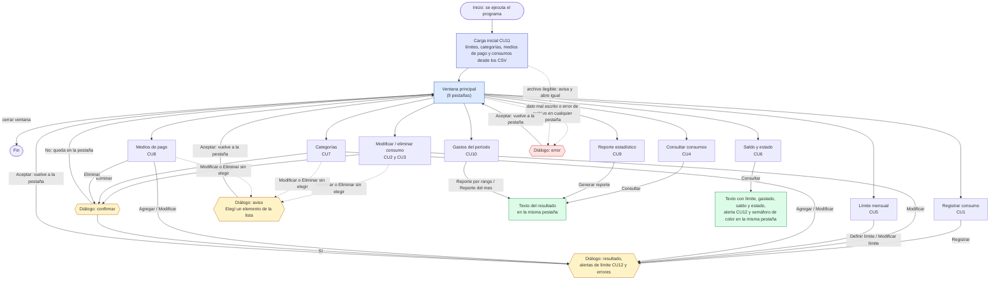

```mermaid
flowchart TB
    I(["Inicio: se ejecuta el programa"]) --> CF["Carga inicial CU11<br/>límites, categorías, medios de pago y consumos desde los CSV"]
    CF --> V["Ventana principal<br/>(9 pestañas)"]
    V -->|"cerrar ventana"| F(["Fin"])

    V --> R["Registrar consumo<br/>CU1"]
    V --> ME["Modificar / eliminar consumo<br/>CU2 y CU3"]
    V --> CO["Consultar consumos<br/>CU4"]
    V --> L["Límite mensual<br/>CU5"]
    V --> S["Saldo y estado<br/>CU6"]
    V --> C["Categorías<br/>CU7"]
    V --> M["Medios de pago<br/>CU8"]
    V --> E["Reporte estadístico<br/>CU9"]
    V --> G["Gastos del período<br/>CU10"]

    R -->|"Registrar"| D1{{"Diálogo: resultado,<br/>alertas de límite CU12 y errores"}}
    ME -->|"Modificar"| D1
    L -->|"Definir límite / Modificar límite"| D1
    C -->|"Agregar / Modificar"| D1
    M -->|"Agregar / Modificar"| D1

    ME -->|"Eliminar"| D2{{"Diálogo: confirmar"}}
    C -->|"Eliminar"| D2
    M -->|"Eliminar"| D2
    D2 -->|"Sí"| D1
    D2 -->|"No: queda en la pestaña"| V
    D1 -->|"Aceptar: vuelve a la pestaña"| V

    ME -.->|"Modificar o Eliminar sin elegir"| AV{{"Diálogo: aviso<br/>Elegí un elemento de la lista"}}
    C -.->|"Modificar o Eliminar sin elegir"| AV
    M -.->|"Modificar o Eliminar sin elegir"| AV
    AV -->|"Aceptar: vuelve a la pestaña"| V

    CO -->|"Consultar"| T["Texto del resultado<br/>en la misma pestaña"]
    E -->|"Generar reporte"| T
    G -->|"Reporte por rango / Reporte del mes"| T
    S -->|"Consultar"| TS["Texto con límite, gastado, saldo y estado,<br/>alerta CU12 y semáforo de color en la misma pestaña"]

    V -.->|"dato mal escrito o error de archivo en cualquier pestaña"| ER{{"Diálogo: error"}}
    CF -.->|"archivo ilegible: avisa y abre igual"| ER
    ER -->|"Aceptar: vuelve a la pestaña"| V

    style CF fill:#e0e7ff,stroke:#4338ca
    style V fill:#dbeafe,stroke:#1e40af
    style D1 fill:#fef3c7,stroke:#b45309
    style D2 fill:#fef3c7,stroke:#b45309
    style AV fill:#fef3c7,stroke:#b45309
    style ER fill:#fee2e2,stroke:#b91c1c
    style T fill:#dcfce7,stroke:#15803d
    style TS fill:#dcfce7,stroke:#15803d
```