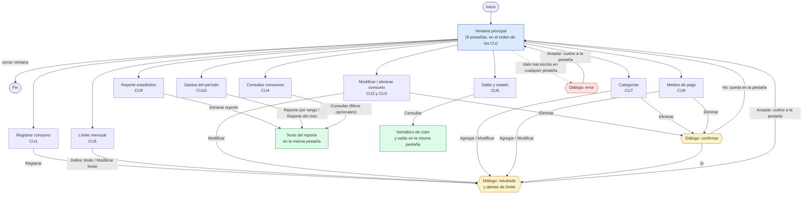

# Diagrama de navegación – Interfaz gráfica (VistaGrafica)

```mermaid
flowchart TB
    I(["Inicio"]) --> V["Ventana principal<br/>(9 pestañas, en el orden de los CU)"]
    V -->|"cerrar ventana"| F(["Fin"])

    V --> R["Registrar consumo<br/>CU1"]
    V --> ME["Modificar / eliminar consumo<br/>CU2 y CU3"]
    V --> Q["Consultar consumos<br/>CU4"]
    V --> L["Límite mensual<br/>CU5"]
    V --> S["Saldo y estado<br/>CU6"]
    V --> C["Categorías<br/>CU7"]
    V --> M["Medios de pago<br/>CU8"]
    V --> E["Reporte estadístico<br/>CU9"]
    V --> G["Gastos del período<br/>CU10"]

    R -->|"Registrar"| D1{{"Diálogo: resultado<br/>y alertas de límite"}}
    L -->|"Definir límite / Modificar límite"| D1
    ME -->|"Modificar"| D1
    ME -->|"Eliminar"| D2
    C -->|"Agregar / Modificar"| D1
    M -->|"Agregar / Modificar"| D1
    C -->|"Eliminar"| D2{{"Diálogo: confirmar"}}
    M -->|"Eliminar"| D2
    D2 -->|"Sí"| D1
    D2 -->|"No: queda en la pestaña"| V
    D1 -->|"Aceptar: vuelve a la pestaña"| V

    E -->|"Generar reporte"| T["Texto del reporte<br/>en la misma pestaña"]
    G -->|"Reporte por rango / Reporte del mes"| T
    Q -->|"Consultar (filtros opcionales)"| T
    S -->|"Consultar"| SM["Semáforo de color<br/>y saldo en la misma pestaña"]

    V -.->|"dato mal escrito en cualquier pestaña"| ER{{"Diálogo: error"}}
    ER -->|"Aceptar: vuelve a la pestaña"| V

    style V fill:#dbeafe,stroke:#1e40af
    style D1 fill:#fef3c7,stroke:#b45309
    style D2 fill:#fef3c7,stroke:#b45309
    style ER fill:#fee2e2,stroke:#b91c1c
    style T fill:#dcfce7,stroke:#15803d
    style SM fill:#dcfce7,stroke:#15803d
```
