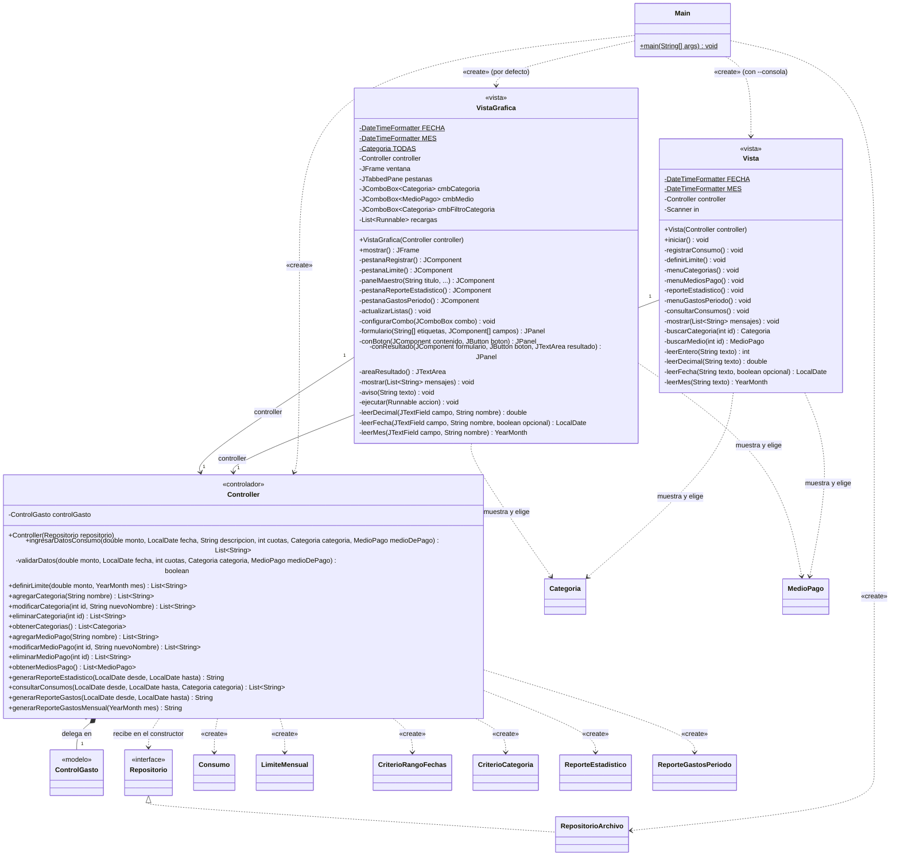

# Diagrama de vista y controlador

```mermaid
classDiagram
    direction TB

    class Main {
        +main(String[] args)$ void
    }

    class Vista {
        <<vista>>
        -DateTimeFormatter FECHA$
        -DateTimeFormatter MES$
        -Controller controller
        -Scanner in
        +Vista(Controller controller)
        +iniciar() void
        -registrarConsumo() void
        -definirLimite() void
        -menuCategorias() void
        -menuMediosPago() void
        -reporteEstadistico() void
        -menuGastosPeriodo() void
        -consultarConsumos() void
        -mostrar(List~String~ mensajes) void
        -buscarCategoria(int id) Categoria
        -buscarMedio(int id) MedioPago
        -leerEntero(String texto) int
        -leerDecimal(String texto) double
        -leerFecha(String texto, boolean opcional) LocalDate
        -leerMes(String texto) YearMonth
    }

    class VistaGrafica {
        <<vista>>
        -DateTimeFormatter FECHA$
        -DateTimeFormatter MES$
        -Categoria TODAS$
        -Controller controller
        -JFrame ventana
        -JTabbedPane pestanas
        -JComboBox~Categoria~ cmbCategoria
        -JComboBox~MedioPago~ cmbMedio
        -JComboBox~Categoria~ cmbFiltroCategoria
        -List~Runnable~ recargas
        +VistaGrafica(Controller controller)
        +mostrar() JFrame
        -pestanaRegistrar() JComponent
        -pestanaLimite() JComponent
        -panelMaestro(String titulo, ...) JComponent
        -pestanaReporteEstadistico() JComponent
        -pestanaGastosPeriodo() JComponent
        -actualizarListas() void
        -configurarCombo(JComboBox combo) void
        -formulario(String[] etiquetas, JComponent[] campos) JPanel
        -conBoton(JComponent contenido, JButton boton) JPanel
        -conResultado(JComponent formulario, JButton boton, JTextArea resultado) JPanel
        -areaResultado() JTextArea
        -mostrar(List~String~ mensajes) void
        -aviso(String texto) void
        -ejecutar(Runnable accion) void
        -leerDecimal(JTextField campo, String nombre) double
        -leerFecha(JTextField campo, String nombre, boolean opcional) LocalDate
        -leerMes(JTextField campo, String nombre) YearMonth
    }

    class Controller {
        <<controlador>>
        -ControlGasto controlGasto
        +Controller(Repositorio repositorio)
        +ingresarDatosConsumo(double monto, LocalDate fecha, String descripcion, int cuotas, Categoria categoria, MedioPago medioDePago) List~String~
        -validarDatos(double monto, LocalDate fecha, int cuotas, Categoria categoria, MedioPago medioDePago) boolean
        +definirLimite(double monto, YearMonth mes) List~String~
        +agregarCategoria(String nombre) List~String~
        +modificarCategoria(int id, String nuevoNombre) List~String~
        +eliminarCategoria(int id) List~String~
        +obtenerCategorias() List~Categoria~
        +agregarMedioPago(String nombre) List~String~
        +modificarMedioPago(int id, String nuevoNombre) List~String~
        +eliminarMedioPago(int id) List~String~
        +obtenerMediosPago() List~MedioPago~
        +generarReporteEstadistico(LocalDate desde, LocalDate hasta) String
        +consultarConsumos(LocalDate desde, LocalDate hasta, Categoria categoria) List~String~
        +generarReporteGastos(LocalDate desde, LocalDate hasta) String
        +generarReporteGastosMensual(YearMonth mes) String
    }

    class ControlGasto {
        <<modelo>>
    }
    class Repositorio {
        <<interface>>
    }
    class RepositorioArchivo
    class Categoria
    class MedioPago
    class Consumo
    class LimiteMensual
    class CriterioRangoFechas
    class CriterioCategoria
    class ReporteEstadistico
    class ReporteGastosPeriodo

    Main ..> Vista : «create» (con --consola)
    Main ..> VistaGrafica : «create» (por defecto)
    Main ..> Controller : «create»
    Main ..> RepositorioArchivo : «create»

    Vista "1" --> "1" Controller : controller
    VistaGrafica "1" --> "1" Controller : controller
    Vista ..> Categoria : muestra y elige
    Vista ..> MedioPago : muestra y elige
    VistaGrafica ..> Categoria : muestra y elige
    VistaGrafica ..> MedioPago : muestra y elige

    Controller "1" *-- "1" ControlGasto : delega en
    Controller ..> Repositorio : recibe en el constructor
    Controller ..> Consumo : «create»
    Controller ..> LimiteMensual : «create»
    Controller ..> CriterioRangoFechas : «create»
    Controller ..> CriterioCategoria : «create»
    Controller ..> ReporteEstadistico : «create»
    Controller ..> ReporteGastosPeriodo : «create»
    Repositorio <|.. RepositorioArchivo
```
