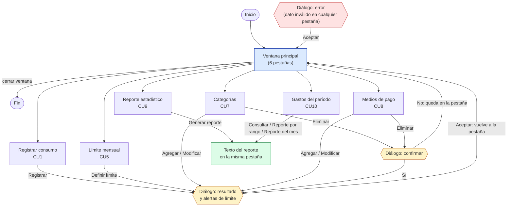

```mermaid
flowchart TB
    I(["Inicio"]) --> V["Ventana principal<br/>(6 pestañas)"]
    V -->|"cerrar ventana"| F(["Fin"])

    V --> R["Registrar consumo<br/>CU1"]
    V --> L["Límite mensual<br/>CU5"]
    V --> C["Categorías<br/>CU7"]
    V --> M["Medios de pago<br/>CU8"]
    V --> E["Reporte estadístico<br/>CU9"]
    V --> G["Gastos del período<br/>CU10"]

    R -->|"Registrar"| D1{{"Diálogo: resultado<br/>y alertas de límite"}}
    L -->|"Definir límite"| D1
    C -->|"Agregar / Modificar"| D1
    M -->|"Agregar / Modificar"| D1
    C -->|"Eliminar"| D2{{"Diálogo: confirmar"}}
    M -->|"Eliminar"| D2
    D2 -->|"Sí"| D1
    D2 -->|"No: queda en la pestaña"| V
    D1 -->|"Aceptar: vuelve a la pestaña"| V

    E -->|"Generar reporte"| T["Texto del reporte<br/>en la misma pestaña"]
    G -->|"Consultar / Reporte por rango / Reporte del mes"| T

    ER{{"Diálogo: error<br/>(dato inválido en cualquier pestaña)"}}
    ER -->|"Aceptar"| V

    style V fill:#dbeafe,stroke:#1e40af
    style D1 fill:#fef3c7,stroke:#b45309
    style D2 fill:#fef3c7,stroke:#b45309
    style ER fill:#fee2e2,stroke:#b91c1c
    style T fill:#dcfce7,stroke:#15803d
```
