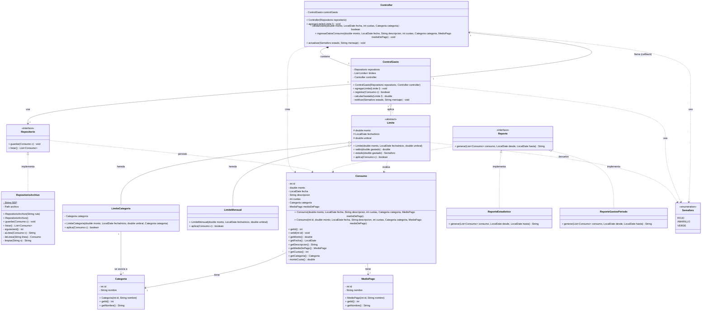

```mermaid
classDiagram
    class Controller {
        - ControlGasto controlGasto
        + Controller(Repositorio repositorio)
        + agregarLimite(Limite l) void
        - validarDatos(double monto, LocalDate fecha, int cuotas, Categoria categoria) boolean
        + ingresarDatosConsumo(double monto, LocalDate fecha, String descripcion, int cuotas, Categoria categoria, MedioPago medioDePago) void
        + actualizar(Semaforo estado, String mensaje) void
    }

    class ControlGasto {
        - Repositorio repositorio
        - List~Limite~ limites
        - Controller controller
        + ControlGasto(Repositorio repositorio, Controller controller)
        + agregarLimite(Limite l) void
        + registrar(Consumo c) boolean
        - calcularGastado(Limite l) double
        - notificar(Semaforo estado, String mensaje) void
    }

    class Repositorio {
        <<interface>>
        + guardar(Consumo c) void
        + listar() List~Consumo~
    }

    class RepositorioArchivo {
        - String SEP$
        - Path archivo
        + RepositorioArchivo(String ruta)
        + RepositorioArchivo()
        + guardar(Consumo c) void
        + listar() List~Consumo~
        - siguienteId() int
        - aLinea(Consumo c) String
        - deLinea(String linea) Consumo
        - limpiar(String s) String
    }

    class Consumo {
        - int id
        - double monto
        - LocalDate fecha
        - String descripcion
        - int cuotas
        - Categoria categoria
        - MedioPago medioDePago
        + Consumo(double monto, LocalDate fecha, String descripcion, int cuotas, Categoria categoria, MedioPago medioDePago)
        + Consumo(int id, double monto, LocalDate fecha, String descripcion, int cuotas, Categoria categoria, MedioPago medioDePago)
        + getId() int
        + setId(int id) void
        + getMonto() double
        + getFecha() LocalDate
        + getDescripcion() String
        + getMedioDePago() MedioPago
        + getCuotas() int
        + getCategoria() Categoria
        - montoCuota() double
    }

    class Categoria {
        - int id
        - String nombre
        + Categoria(int id, String nombre)
        + getId() int
        + getNombre() String
    }

    class MedioPago {
        - int id
        - String nombre
        + MedioPago(int id, String nombre)
        + getId() int
        + getNombre() String
    }

    class Limite {
        <<abstract>>
        # double monto
        # LocalDate fechaInicio
        # double umbral
        + Limite(double monto, LocalDate fechaInicio, double umbral)
        + saldo(double gastado) double
        + estado(double gastado) Semaforo
        + aplica(Consumo c) boolean*
    }

    class LimiteMensual {
        + LimiteMensual(double monto, LocalDate fechaInicio, double umbral)
        + aplica(Consumo c) boolean
    }

    class LimiteCategoria {
        - Categoria categoria
        + LimiteCategoria(double monto, LocalDate fechaInicio, double umbral, Categoria categoria)
        + aplica(Consumo c) boolean
    }

    class Reporte {
        <<interface>>
        + generar(List~Consumo~ consumo, LocalDate desde, LocalDate hasta) String
    }

    class ReporteEstadistico {
        + generar(List~Consumo~ consumo, LocalDate desde, LocalDate hasta) String
    }

    class ReporteGastosPeriodo {
        + generar(List~Consumo~ consumo, LocalDate desde, LocalDate hasta) String
    }

    class Semaforo {
        <<enumeration>>
        ROJO
        AMARILLO
        VERDE
    }

    Controller "1" *-- "1" ControlGasto : contiene
    ControlGasto "1" --> "1" Controller : llama (callback)
    ControlGasto "1" o-- "*" Limite : aplica
    ControlGasto "1" --> "1" Repositorio : usa

    Repositorio <|.. RepositorioArchivo : implementa
    Limite <|-- LimiteMensual : hereda
    Limite <|-- LimiteCategoria : hereda
    LimiteCategoria "1" --> "1" Categoria : se asocia a

    Consumo "*" --> "1" Categoria : tiene
    Consumo "*" --> "1" MedioPago : tiene

    Reporte <|.. ReporteEstadistico : implementa
    Reporte <|.. ReporteGastosPeriodo : implementa

    Controller ..> Consumo : crea
    Repositorio ..> Consumo : persiste
    Reporte ..> Consumo : analiza
    Limite ..> Consumo : evalúa
    Limite ..> Semaforo : devuelve
    ControlGasto ..> Semaforo : usa
    Controller ..> Semaforo : usa
```
-------------------------------------------------------

```mermaid
classDiagram
    direction TB
    class Observador {
        <<interface>>
        +actualizar(msg: String)
    }
    class Controller {
        +iniciar()
        +ingresarDatosConsumo(monto: double, fecha: Date, descripcion: String, cuotas: int, categoria: Categoria, medioPago: MedioPago)
        -validarDatos(monto: double, fecha: Date) boolean
        +actualizar(msg: String)
    }
    class Criterio {
        <<interface>>
        +cumple(c: Consumo) boolean
    }
    class CriterioCategoria {
        -categoria: Categoria
        +cumple(c: Consumo) boolean
    }
    class CriterioRangoFechas {
        -desde: Date
        -hasta: Date
        +cumple(c: Consumo) boolean
    }
    class Reporte {
        <<interface>>
        +generar(consumos: List~Consumo~, desde: Date, hasta: Date) String
    }
    class ReporteEstadistico {
        +generar(consumos: List~Consumo~, desde: Date, hasta: Date) String
    }
    class ReporteGastosPeriodo {
        +generar(consumos: List~Consumo~, desde: Date, hasta: Date) String
    }
    class Repositorio {
        <<interface>>
        +guardar(c: Consumo)
        +cargar() List~Consumo~
        +importar(archivo: String) List~Consumo~
    }
    class RepositorioArchivo {
        -ruta: String
        +guardar(c: Consumo)
        +cargar() List~Consumo~
        +importar(archivo: String) List~Consumo~
    }
    class Semaforo {
        <<enumeration>>
        VERDE
        AMARILLO
        ROJO
    }
    class Periodo {
        <<enumeration>>
        SEMANAL
        MENSUAL
    }
    class ControlGastos {
        -instancia: ControlGastos$
        -consumos: List~Consumo~
        -limites: List~Limite~
        -categorias: List~Categoria~
        -medios: List~MedioPago~
        -obs: List~Observador~
        -repositorio: Repositorio
        +getInstancia()$ ControlGastos
        +registrar(c: Consumo) boolean
        +modificar(c: Consumo) boolean
        +eliminar(id: int) boolean
        +filtrar(c: Criterio) List~Consumo~
        +definirLimite(l: Limite)
        +consultarEstado(l: Limite) Semaforo
        +suscribir(o: Observador)
        +desuscribir(o: Observador)
        +notificar(msg: String)
        +reporte(r: Reporte, desde: Date, hasta: Date) String
        +getCategorias() List~Categoria~
        +getMedios() List~MedioPago~
        -calcularGastado(l: Limite) double
    }
    class Consumo {
        -id: int
        -monto: double
        -fecha: Date
        -descripcion: String
        -cuotas: int
        -categoria: Categoria
        -medioPago: MedioPago
        +montoCuota() double
        +Consumo(id: int, monto: double, fecha: Date, descripcion: String, cuotas: int, categoria: Categoria, medioPago: MedioPago)
        +montoCuota() double
    }
    class Limite {
        -monto: double
        -periodo: Periodo
        -fechaInicio: Date
        -umbral: double
        -categoria: Categoria
        +saldo(gastado: double) double
        +estado(gastado: double) Semaforo
    }
    class Categoria {
        -id: int
        -nombre: String
    }
    class MedioPago {
        -id: int
        -nombre: String
    }
    Controller ..|> Observador
    Controller ..> ControlGastos : usa
    CriterioCategoria ..|> Criterio
    CriterioRangoFechas ..|> Criterio
    ReporteEstadistico ..|> Reporte
    ReporteGastosPeriodo ..|> Reporte
    RepositorioArchivo ..|> Repositorio
    ControlGastos "1" o-- "*" Consumo
    ControlGastos "1" o-- "*" Limite
    ControlGastos "1" o-- "*" Categoria
    ControlGastos "1" o-- "*" MedioPago
    ControlGastos "1" --> "*" Observador : notifica
    ControlGastos --> Repositorio : utiliza
    ControlGastos ..> Criterio : aplica
    ControlGastos ..> Reporte : ejecuta
    ControlGastos ..> Semaforo
    Consumo "*" --> "1" Categoria
    Consumo "*" --> "1" MedioPago
    Limite "*" --> "0..1" Categoria
    Limite ..> Semaforo
    Limite -- Periodo
    Controller ..> Consumo : crea
    Controller ..> Categoria
    Controller ..> MedioPago
```
