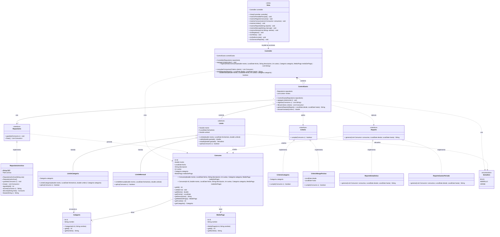

```mermaid
classDiagram
    class Vista {
        <<vista>>
        - Controller controller
        + Vista(Controller controller)
        + mostrarPantallaPrincipal() void
        + mostrarRegistroConsumo() void
        + mostrarConsumos(List~Consumo~ consumos) void
        + mostrarLimites() void
        + mostrarReporte(String reporte) void
        + mostrarMensaje(String mensaje) void
        + mostrarAlertas(List~String~ alertas) void
        + clicRegistrar() void
        + clicFiltrar() void
        + clicDefinirLimite() void
        + clicGenerarReporte() void
    }

    class Controller {
        - ControlGasto controlGasto
        + Controller(Repositorio repositorio)
        + agregarLimite(Limite l) void
        + ingresarDatosConsumo(double monto, LocalDate fecha, String descripcion, int cuotas, Categoria categoria, MedioPago medioDePago) List~String~
        + consultarConsumos(Criterio criterio) List~Consumo~
        + pedirReporte(Reporte r, LocalDate desde, LocalDate hasta) String
        - validarDatos(double monto, LocalDate fecha, int cuotas, Categoria categoria) boolean
    }

    class ControlGasto {
        - Repositorio repositorio
        - List~Limite~ limites
        + ControlGasto(Repositorio repositorio)
        + agregarLimite(Limite l) void
        + registrar(Consumo c) List~String~
        + filtrar(Criterio criterio) List~Consumo~
        + generarReporte(Reporte r, LocalDate desde, LocalDate hasta) String
        - calcularGastado(Limite l) double
    }

    class Repositorio {
        <<interface>>
        + guardar(Consumo c) void
        + listar() List~Consumo~
    }

    class RepositorioArchivo {
        - String SEP$
        - Path archivo
        + RepositorioArchivo(String ruta)
        + RepositorioArchivo()
        + guardar(Consumo c) void
        + listar() List~Consumo~
        - siguienteId() int
        - aLinea(Consumo c) String
        - deLinea(String linea) Consumo
        - limpiar(String s) String
    }

    class Consumo {
        - int id
        - double monto
        - LocalDate fecha
        - String descripcion
        - int cuotas
        - Categoria categoria
        - MedioPago medioDePago
        + Consumo(double monto, LocalDate fecha, String descripcion, int cuotas, Categoria categoria, MedioPago medioDePago)
        + Consumo(int id, double monto, LocalDate fecha, String descripcion, int cuotas, Categoria categoria, MedioPago medioDePago)
        + getId() int
        + setId(int id) void
        + getMonto() double
        + getFecha() LocalDate
        + getDescripcion() String
        + getMedioDePago() MedioPago
        + getCuotas() int
        + getCategoria() Categoria
    }

    class Categoria {
        - int id
        - String nombre
        + Categoria(int id, String nombre)
        + getId() int
        + getNombre() String
    }

    class MedioPago {
        - int id
        - String nombre
        + MedioPago(int id, String nombre)
        + getId() int
        + getNombre() String
    }

    class Limite {
        <<abstract>>
        # double monto
        # LocalDate fechaInicio
        # double umbral
        + Limite(double monto, LocalDate fechaInicio, double umbral)
        + saldo(double gastado) double
        + estado(double gastado) Semaforo
        + aplica(Consumo c)* boolean
    }

    class LimiteMensual {
        + LimiteMensual(double monto, LocalDate fechaInicio, double umbral)
        + aplica(Consumo c) boolean
    }

    class LimiteCategoria {
        - Categoria categoria
        + LimiteCategoria(double monto, LocalDate fechaInicio, double umbral, Categoria categoria)
        + aplica(Consumo c) boolean
    }

    class Criterio {
        <<interface>>
        + cumple(Consumo c) boolean
    }

    class CriterioCategoria {
        - Categoria categoria
        + cumple(Consumo c) boolean
    }

    class CriterioRangoFechas {
        - LocalDate desde
        - LocalDate hasta
        + cumple(Consumo c) boolean
    }

    class Reporte {
        <<interface>>
        + generar(List~Consumo~ consumos, LocalDate desde, LocalDate hasta) String
    }

    class ReporteEstadistico {
        + generar(List~Consumo~ consumos, LocalDate desde, LocalDate hasta) String
    }

    class ReporteGastosPeriodo {
        + generar(List~Consumo~ consumos, LocalDate desde, LocalDate hasta) String
    }

    class Semaforo {
        <<enumeration>>
        ROJO
        AMARILLO
        VERDE
    }

    Vista --> Controller : le pide las acciones
    Controller "1" *-- "1" ControlGasto : contiene
    ControlGasto "1" o-- "*" Limite : controla
    ControlGasto "1" --> "1" Repositorio : usa

    Repositorio <|.. RepositorioArchivo : implementa
    Limite <|-- LimiteMensual : hereda
    Limite <|-- LimiteCategoria : hereda
    LimiteCategoria "*" --> "1" Categoria : se asocia a

    Consumo "*" --> "1" Categoria : tiene
    Consumo "*" --> "1" MedioPago : tiene

    Criterio <|.. CriterioCategoria : implementa
    Criterio <|.. CriterioRangoFechas : implementa
    Reporte <|.. ReporteEstadistico : implementa
    Reporte <|.. ReporteGastosPeriodo : implementa

    Controller ..> Consumo : crea
    ControlGasto ..> Criterio : aplica
    ControlGasto ..> Reporte : ejecuta
    ControlGasto ..> Semaforo : usa
    Repositorio ..> Consumo : persiste
    Reporte ..> Consumo : analiza
    Limite ..> Consumo : evalúa
    Limite ..> Semaforo : devuelve
```
