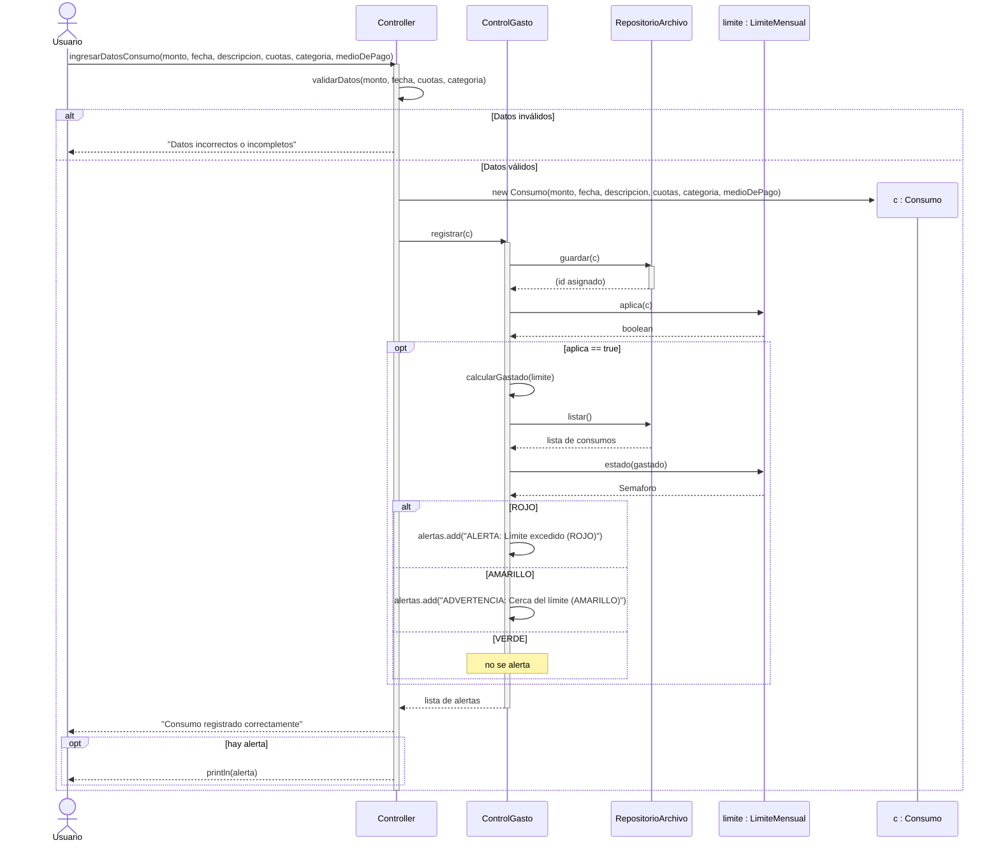

```mermaid
sequenceDiagram
    actor Usuario
    participant Controller
    participant ControlGasto
    participant R as RepositorioArchivo
    participant L as limite : LimiteMensual

    Usuario->>Controller: ingresarDatosConsumo(monto, fecha, descripcion, cuotas, categoria, medioDePago)
    activate Controller

    Controller->>Controller: validarDatos(monto, fecha, cuotas, categoria)

    alt Datos inválidos
        Controller-->>Usuario: "Datos incorrectos o incompletos"
    else Datos válidos
        create participant C as c : Consumo
        Controller->>C: new Consumo(monto, fecha, descripcion, cuotas, categoria, medioDePago)

        Controller->>ControlGasto: registrar(c)
        activate ControlGasto

        ControlGasto->>R: guardar(c)
        activate R
        R-->>ControlGasto: (id asignado)
        deactivate R

        ControlGasto->>L: aplica(c)
        L-->>ControlGasto: boolean

        opt aplica == true
            ControlGasto->>ControlGasto: calcularGastado(limite)
            ControlGasto->>R: listar()
            R-->>ControlGasto: lista de consumos

            ControlGasto->>L: estado(gastado)
            L-->>ControlGasto: Semaforo

            alt ROJO
                ControlGasto->>ControlGasto: alertas.add("ALERTA: Límite excedido (ROJO)")
            else AMARILLO
                ControlGasto->>ControlGasto: alertas.add("ADVERTENCIA: Cerca del límite (AMARILLO)")
            else VERDE
                Note over ControlGasto: no se alerta
            end
        end

        ControlGasto-->>Controller: lista de alertas
        deactivate ControlGasto

        Controller-->>Usuario: "Consumo registrado correctamente"
        opt hay alerta
            Controller-->>Usuario: println(alerta)
        end
    end
    deactivate Controller

```


```
