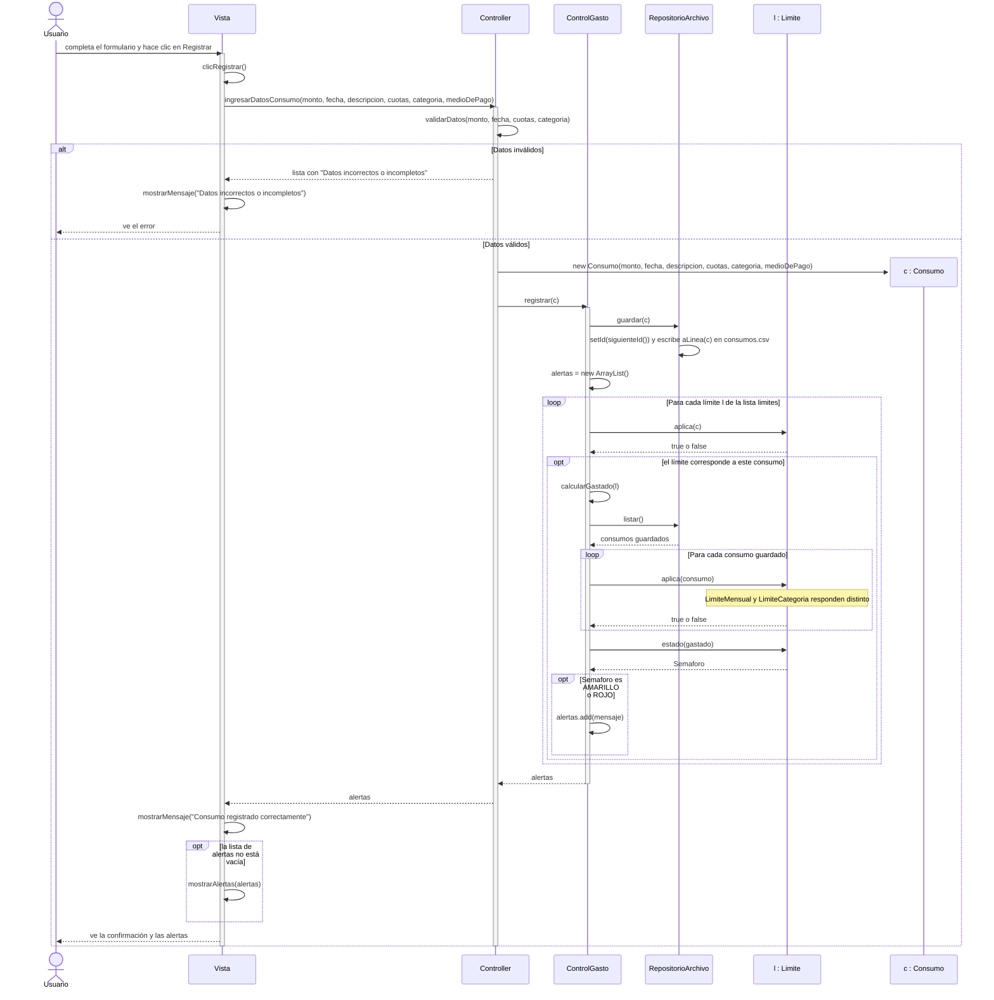

```mermaid
sequenceDiagram
    actor Usuario
    participant V as Vista
    participant CT as Controller
    participant CG as ControlGasto
    participant R as RepositorioArchivo
    participant L as l : Limite

    Usuario->>V: completa el formulario y hace clic en Registrar
    activate V
    V->>V: clicRegistrar()
    V->>CT: ingresarDatosConsumo(monto, fecha, descripcion, cuotas, categoria, medioDePago)
    activate CT
    CT->>CT: validarDatos(monto, fecha, cuotas, categoria)

    alt Datos inválidos
        CT-->>V: lista con "Datos incorrectos o incompletos"
        V->>V: mostrarMensaje("Datos incorrectos o incompletos")
        V-->>Usuario: ve el error
    else Datos válidos
        create participant C as c : Consumo
        CT->>C: new Consumo(monto, fecha, descripcion, cuotas, categoria, medioDePago)

        CT->>CG: registrar(c)
        activate CG
        CG->>R: guardar(c)
        R->>R: setId(siguienteId()) y escribe aLinea(c) en consumos.csv
        CG->>CG: alertas = new ArrayList()

        loop Para cada límite l de la lista limites
            CG->>L: aplica(c)
            L-->>CG: true o false
            opt el límite corresponde a este consumo
                CG->>CG: calcularGastado(l)
                CG->>R: listar()
                R-->>CG: consumos guardados
                loop Para cada consumo guardado
                    CG->>L: aplica(consumo)
                    Note over L: LimiteMensual y LimiteCategoria responden distinto 
                    L-->>CG: true o false
                end
                CG->>L: estado(gastado)
                L-->>CG: Semaforo
                opt Semaforo es AMARILLO o ROJO
                    CG->>CG: alertas.add(mensaje)
                end
            end
        end

        CG-->>CT: alertas
        deactivate CG
        CT-->>V: alertas
        V->>V: mostrarMensaje("Consumo registrado correctamente")
        opt la lista de alertas no está vacía
            V->>V: mostrarAlertas(alertas)
        end
        V-->>Usuario: ve la confirmación y las alertas
    end
    deactivate CT
    deactivate V
```
